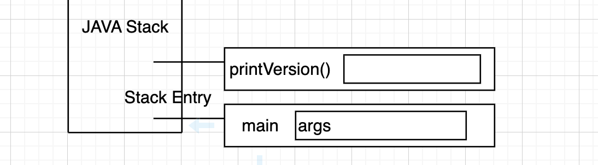

## 객체지향 프로그래밍

객체 지향 프로그래밍은 프로그램을 여러 개의 독립된 단위, 즉 객체들의 모임으로 파악하고자 하는 것이다. 각각의 객체는 메시지를 주고받고, 데이터를 처리한다. 객체 지향이라는 것은 객체 중심적이라는 것이다.


클래스는 설계 도면이라고 생각하면 쉽다. 설계 도면 즉, 클래스를 보고 실제 물체를 만들게 된다. 실제로 만들어진 책상을 오브젝트(Object) 또는 인스턴스(Instance)라고 한다.


## instance를 특별한 이름으로 불러주고 싶다면?

* 참조형 변수(Reference Variable)을 선선한다.
* 참조되지 않는 인스턴스는 쓰레기(Garbage)이다.

클래스는 field들과 method들을 가지고 있다. 이 클래스로만은 아무것도 할 수 없다. 클래스를 이용해 참조형 변수로 인스턴스를 생성해야 한다.

`Class명 참조형변수 = new Class명();`

* `Class명()` 는 생성자이다.
* Heap이라는 메모리 영역에 인스턴스가 생성되고 이 인스턴스를 참조하는 것이 참조형변수이다.


## 클래스

* 클래스는 Field와 Method를 가진다.
* Field는 클래스의 속성, Method는 클래스의 기능을 뜻한다.
* 클래스 선언 방법
  * `접근제한자 class 클래스명 { ... }`
  * 예약어는 식별자로 사용 X
  * 클래스명은 대문자로 시작 + 카멜 표기법


## 클래스 다이어그램

예시: 자판기

* 자판기의 기능
  * 동전넣기
  * 잔액 보여주기
  * 물건 선택 버튼 클릭하기
  * 물건 뱉기

요구사항을 분석해서 기능을 정하는데 보통 명사는 객체(동전, 물건 ...) 동사는 메소드가(넣기, 보여주기, 뱉기 ...) 될 가능성이 크다.


> 우리가 프로그램을 만들 때 설계를 한다는 것은 객체의 이름을 정하고 그 객체와 객체 간의 관계를 표현하는 것이다. 관계는 선을 그어서 표현할 수 있다. (클래스 다이어그램)


### 클래스 메소드

* static이 붙은 메소드는 클래스 메소드라고 부를 것이다.
* 클래스 메소드는 인스턴스를 생성하지 않아도 사용할 수 있다.
  * 사용가능하다? = 메모리에 올라가 있다.
  * 폰노이만의 프로그램 내장 방식: 프로그램은 메모리에 올라 가야지만 실행될 수 있다.

### 메소드

* 기능을 뜻한다

할아버지가 걷는 상황


* 할아버지가 걷기 위해서는 지팡이가 필요하다. 할아버지는 지팡이에 의존하고 있기 때문에 이럴 때엔 점선으로 표시한다.


자판기 클래스 실습

```java
public class VendingMachineMain {
    public static void main(String[] args) {
        VendingMachine vm1 = new VendingMachine();
    }
}
```

```java
public class VendingMachine {
    // field (가지는 것들)
    // 생성자
    // method

}
```


VendingMachineMain 클래스의 main 메소드가 동작하려면 VendingMachine 클래스가 필요하다. 해당 클래스가 main 메소드 안에서 사용되고 있기 때문이다. main 메소드에서 VendingMachine을 사용하는데 그 클래스가 존재하지 않는다면 당연히 컴파일 오류가 발생할 것이다. 그래서 의존한다고 표현하고, 점선으로 그어준다.


또한 main 메소드는 String 클래스도 사용하고 있다. 이 말은 VendingMachineMain은 String 클래스에도 의존하고 있다는 뜻이다. String 클래스는 자바에서 기본 제공되는 클래스이기 때문에 잘 작동하는 것이다.


## 인스턴스 생성법 3가지

1. new 연산자와 생성자를 이용하여 인스턴스 생성
2. 클래스 로더를 이용 - 스프링 프레임워크 관련
3. 메모리에 있는 인스턴스를 복제(clone)하여 만드는 방법 - 거의 사용 X

> 인스턴스를 만들때마다 메모리에 할당되기 때문에 필요한 만큼만 인스턴스를 만들어야 한다.


## 객체지향의 핵심은 "메시징"

의도는 "메시징"이다. 훌륭하고 성장 가능한 시스템을 만들기 위한 핵심은 모듈 내부의 속성과 행동이 어떤가보다 모듈이 어떻게 커뮤니케이션하는 가에 달려있다. - Alan Curtis Kay

객체와 객체는 관계를 가지고 있고 커뮤니케이션이 이루어진다. 여기서 메시징이란 어떤 객체가 어떤 객체의 메소드를 호출하는 것이다. 따라서 객체 지향 프로그래밍을 한다는 것은 메소드가 언제 어떻게 호출되는가, 메소드의 이름은 어떻게 해야하가는가 등을 고민해야 하는 것이다.


### 객체는 자율적인 책임을 가진다.

자율적인 객체란 스스로 정한 원칙에 따라 판단하고 스스로의 의지를 기반으로 행동하는 객체다. 객체가 어떤 행동을 하는 유일한 이유는 다른 객체로부터 요청을 수신했기 때문이다. 요청을 처리하기 위해 객체가 수행하는 행동을 책임이라고 한다.

자율적인 책임의 특징은 객체가 어떻게 해야 하는가가 아니라 무엇을 해야하는가를 설명한다는 것이다.

> 객체지향의 사실과 오해 (위키북스, 조영호)


메시징은 객체가 어떤 객체가 다른 객체의 메소드를 호출하는 것이라고 했는데 이 글을 통해 객체가 어떤 행동을 하는 유일한 이유는 이 객체의 메소드를 다른 객체가 호출했을 때라는 것을 알 수 있다. 객체는 객체의 기능이 호출되었을 때 책임을 가지게 되는 것이다.


## 메소드 선언 방법

`[접근제한자] [static] return_type 메소드이름([매개변수, ...]) { ... }`

- 대괄호[]는 생략 가능하다
- 메소드 이름은 소문자로 시작하는 것이 관례

> 매개변수 vs 전달인자
>
> - 매개변수(parameter): 메소드 정의부분에 나열되어 있는 변수들
> - 전달인자(argument): 메소드를 호출할 때 전달되는 실제 값들


## static 메소드 (클래스 메소드)

static한 메소드는 인스턴스를 생성하지 않아도 호출할 수 있다.

```java
public class VendingMachine {
    public String pushProductButton(int menuId) {
        System.out.println(menuId + "를 전달받았습니다.");
        return "콜라";
    }
  
    public static void printVersion() {
        System.out.println("v1.0");
    }

}
```

pushProductButton 메소드는 `VendingMachine vm1 = new VendingMachine();`로 인스턴스를 생성 후에 사용할 수 있지만 static 메소드인 printVersion 메소드는 인스턴스 생성 없이 바로 `VendingMachine.printVersion();`으로 사용가능하다.

> static 메소드는 바로 알아보기 위해 관례상 클래스 명과 함께 사용한다.


## 메소드 실행 과정

자바에서 new를 하면 인스턴스가 생성되고 이 인스턴스는 Heap이라는 메모리 영역에 올라간다.

인텔리가 아닌 터미널에서 코드를 컴파일하고 실행하려면 다음과 같은 과정이 필요하다.

`javac VendingMachine.java`

`javac VendingMachineMain.java`

`java VendingMachineMain`


java 명령어는 JVM인데 어떻게 VendingMachineMain을 어디서 찾아서 실행하는 걸까?

javac를 이용해 컴파일을 하면 소스 파일이 있던 곳에 class 파일이 생성됐었다. 현재 폴더? out 폴더? 전부 아니다. 정답은 CLASSPATH 클래스 경로에서 main클래스를 찾아 실행한다. CLASSPATH가 .(점)인 경우 현재 경로에서 클래스를 찾게 되는 것이다. 현재 경로가 CLASSPATH로 잡혀있기 때문이다.

IntelliJ는 소스를 컴파일하고 out/production/프로젝트폴더 아래에 class 파일을 생성하는데 해당 폴더를 CLASSPATH로 인식하게 해준다. 

```java
├── out
│   └── production
│       └── JAVA
│           └── practice
│               ├── VendingMachine.class
│               └── VendingMachineMain.class

```

IntelliJ가 java로 실행할 때 -classpath라는 옵션을 주는 것을 볼 수 있다.

`-classpath /Users/jus/dev/JAVA/out/production/JAVA practice.VendingMachineMain`

해당 옵션 뒤의 경로가 모두 CLASSPATH로 인식되는 것이다.


JVM이 클래스를 찾아서 읽어 들이고 읽어 들인 클래스 정보를 PERM이라는 메모리 영역에 저장한다. 인스턴스가 아닌 클래스 자체에 대한 정보가 PERM영역에 올라가는 것이다. 클래스 정보가 PERM영역에 올라가게 되면 JVM은 해당 클래스가 어떤 static 메소드를 가지고 있는지, 인스턴스 메소드를 가지고 있는지 모두 알게 된다.

JVM이 프로그램 시작점인 main 메소드를 찾아 실행해주면 Java Stack이라고 불리는 메모리 영역에 실행된 main메소드가 올라가게 된다. Stack은 FILO 자료구조로 먼저 들어간 자료가 나중에 나오는 구조이다.

> Java Stack에 저장된 메소드 실행정보 하나를 Stack Entry라고 한다.

Stack Entry안 main 메소드 안에 선언된 변수들도 Stack Entry에 저장되고 이렇게 메소드 안에서 선언된 변수를 local변수라고 한다. main 메소드의 argument인 String[] args 변수도 Stack Entry에 생성되게 된다.

main 메소드가 실행되면 Heap 메모리에 String배열 인스턴스가 만들어지고 이 인스턴스를 Stack Entry 안의 args 변수가 참조하게 된다.

> Stack Entry에는 프로그램 카운트라고 해서 몇번째 줄을 실행하고 있는지에 대한 정보도 기억하고 있다.

~~~~


만약 JVM이 `VendingMachine.printVersion();` 코드를 만나면 printVersion() 메소드는 static 메소드이기 때문에 실행 가능하다고 판단하고 실행해주는 것이다. printVersion() 메소드가 실행되면 Java Stack에 스택 엔트리가 하나 더 추가된다.




printVersion() 메소드가 실행 후에 종료가 되면 해당 메소드의 실행 정보를 담고 있는 스택 엔트리는 자바 스택에서 제거된다.


이후에 JVM이 new로 인스턴스를 생성하는 코드를 만나면 인스턴스를 Heap 메모리에 생성하고 vm 변수가 그 인스턴스를 참조하게 되는 것이다.


이후에 `vm.pushProductButton(100);` 코드를 만나면 Stack Entry에 pushProductButton이 생성되고 메소드 안에서 선언된 변수 menuId가 같이 생성된다.


이후에 코드가 다 실행되면 pushProductButton() 메소드가 종료되면서 자바 스택에서 제거된다. 이후 main 메소드도 종료되면서 자바 스택에서 제거된다. 자바 스택에는 더 이상 남아있는 스택 엔트리가 없게 되면서 프로그램이 종료된다.


메소드 안에서 선언된 변수는 지역변수이고, 지역변수는 메소드가 실행될 때 생성되고 종료될 때 사라진다. 같은 메소드를 동시에 열번 호출하면 그 메소드 안 지역변수들은 각각 다른 영역에 저장되어 사용되는 것이다. 따라서 동시에 메소드가 호출되어도 중복되는 문제가 발생하진 않는다.


---


`C c = new C();` C()는 생성자를 뜻한다.

C 클래스에 생성자가 없으면 컴파일 시점에서 자동으로 기본 생성자가 만들어진다.

기본 생성자

```java
public C(){}
```


## private

접근 제한자 private은 해당 클래스 안에서만 접근할 수 있도록 해준다. 만약 기본 생성자를 private로 바꿔준다면 그 클래스는 인스턴스를 못만들게 되는 것이다. 강제로 인스턴스를 못만들게 하고 싶으면 이 방법을 사용하면 될 것이다. 그렇게 되면 static이 붙은 메소드만 사용할 수 있게 된다.


## 클래스 메소드 vs 인스턴스 메소드

* 인스턴스 별로 다르게 동작해야 한다면 인스턴스 메소드
* static 메소드는 객체 생성이나 유틸리티 관련에서 사용될 때가 있다.
* 되도록 인스턴스 메소드를 사용한다.

인스턴스 메소드와 클래스 메소드를 잘 이해하려면 field에 대한 이해가 필요하다.

### 필드(field)

* 클래스가 가지는 속성 (사람 클래스의 필드: 이름, 생일 ...)
* 필드는 어떤 키워드와 함께 사용하느냐에 따라서 사용방법이 달라진다.
* static이라는 키워드가 함께 사용되는 필드는 클래스 필드, 아닌 경우는 인스턴스 필드라고 한다.

### 필드 선언 방법

`[접근제한자] [static] [final] 타입 필드명 [=초기값];`

대괄호[]는 생략가능

* 초기값이 없을 경우 참조형인 경우 null, boolean형일 경우 false, 기본형일 경우 0으로 초기화된다.


---

`String a = "안녕";`

문자열 String은 참조형 타입으로 인스턴스를 생성해서 참조해야할 것 같지만 문자열은 new를 사용하지 않고도 인스턴스를 사용할 수 있다. 되도록 new를 사용하지 말자.

---


## NullPointException

```java
String a;
System.out.println(a.length());
```

위 코드를 실행해보면 NullPointException 에러가 발생하며 프로그램이 종료된다. a가 아무것도 참조하지 않는 상태 즉, null값이므로 발생하는 에러이다.


## static 필드 (클래스 필드)

```java
public class Person {
    String name;
    static int count = 0;
}
```

```java
public class PersonTest {
    public static void main(String[] args) {
        Person p1 = new Person();
        Person p2 = new Person();

        System.out.println(p1.count);
        System.out.println(p2.count);
        p1.count++;
        System.out.println(p1.count);
        System.out.println(p2.count);

    }
}

```

[실행결과]

0
0
1
1


p1의 count를 증가시켰는데 p2의 count도 증가된 것을 볼 수 있다. 왜 그런걸까?

JVM은 CLASSPATH에서 클래스를 찾아 실행한다고 했다. `Person p1 = new Person()'`으로 Person 인스턴스를 생성하는데 인스턴스를 만들기 전에 JVM이 하는 일이 있다. 먼저 Person클래스가 CLASSPATH에 있는지 찾아보고 없으면 ClassNotFoundException 오류를 발생한다. Person 클래스를 찾으면 Person클래스 정보를 메모리에 올리게 된다.

여기서 중요한 것은 클래스 정보 자체는 정적이라는 것이다. 클래스 정보 자체는 실행되는 것이 아니기 때문이다. SSD나 하드디스크에 저장되어 있던 클래스를 읽어들여서 자바가 사용할 수 있는 메모리 영역에 그 정보를 올리는 것이다.

이때 클래스에 static한 필드가 있는지 살펴본다. static한 필드는 정적 영역에 따로 저장된다. Person이 가지고 있는 count변수는 별도로 저장되고 0으로 초기화되는 것이다. 따라서 count 변수는 인스턴스별로 각자 가지는 것이 아닌 정적 영역에서 따로 관리되는 것이다.

그래서 p1.count와 p2.count가 같은 메모리의 값을 출력하게 된 것이다.

> ! 인스턴스를 만들지 않아도 Person을 JVM이 읽어 들일 때 count 변수는 메모리에 따로 올라간다.
>
> 그래서 사실 count를 사용할 때에는 참조변수명.count가 아닌 클래스명.count로 사용하는 것이 좋다. `Person.count`
