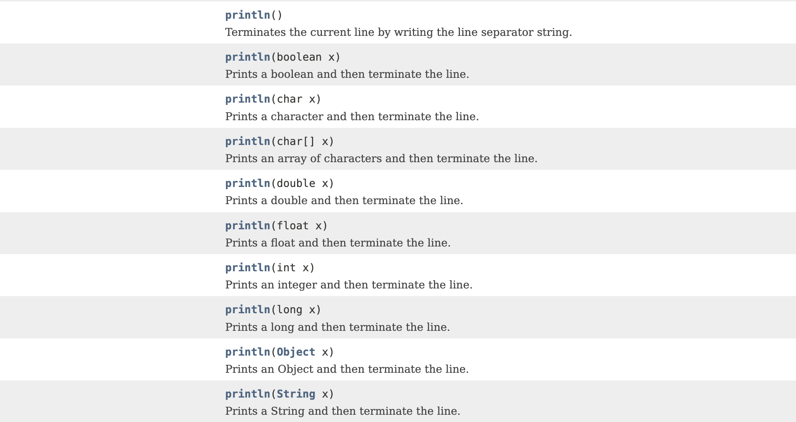

## 클래스 메소드에서 인스턴스 필드를 사용하지 못하는 이유

인스턴스 필드와 인스턴스 메소드는 인스턴스를 생성하지 않고 사용할 수 없다.

`java: non-static method printName() cannot be referenced from a static context`


반면 클래스 필드와 클래스 메소드는 JVM이 Person클래스 정보를 읽어 들일 때 이미 메모리에 올라간다. 인스턴스 필드와 메소드는 반드시 인스턴스를 생성 후 그 인스턴스를 참조하는 참조변수를 이용해서 접근해야 하기 때문에 메모리에 생성되는 시점이 달라서 클래스 메소드 안에서 인스턴스 필드를 사용할 수 없는 것이다. 클래스 메소드가 실행되는 시점에서는 인스턴스 필드가 메모리에 없어서 애초에 컴파일 오류가 발생된다.

`Non-static field '인스턴스 필드명' cannot be referenced from a static context`


> static한 필드는 클래스가 로딩될 때 딱 한번 메모리에 올라가고 초기화 된다!


## static 블록

클래스가 스태틱 영역에 배치될 때 실행되는 코드 블록으로 클래스 필드를 초기화할 수 있다.

```java
static int count;    // 클래스 필드
static{    // static 블록
    count=1000;
}
```


#### main 메소드보다 먼저 실행되는 static 블록

```java
public class PersonTest {
    static {
        System.out.println("static block");
    }
    public static void main(String[] args) {
        System.out.println("main block");
    }
}
```

[결과]

```plaintext
static block
main block
```


## 자바의 메모리 영역


JAVA 8부터는 Metaspace 영역이 사용된다. Java Heap은 JVM이 관리하는 메모리 영역, Native Memory는 운영체제가 관리하는 메모리 영역이다.

JAVA 7까지는 JVM이 관리하는 메모리 영역인 PermGen에 클래스 정보가 올라갔었다. 8부터는 Metaspace에 올라간다.


클래스 파일 자체는 정적이다. JVM은 사용해야할 클래스의 정보를 읽어들여서 메모리에 올린다. 동적인 것들은 실행되면서 생성되는 것들을 말한다. 클래스가 저장된 HDD나 SSD는 Ram보다 속도가 느리기도 하고 매번 보조 기억장치에서 읽어들이는 건 성능을 저하시키는 원인이 된다. 따라서 클래스 정보는 처음 사용될 때 메모리에 그 정보를 올리고 필요할 때마다 사용한다.

```java
Person p1 = new Person();
Person p2 = new Person();
```

위 코드의 첫줄에서 Person을 처음 만나게 되면 이 클래스를 읽어 들여서 그 정보를 메모리에 올린 후 이를 이용해 인스턴스를 생성한다. 두번째 줄을 실행할 때에는 이미 메모리에 올라가 있는 Person 클래스 정보를 이용해 인스턴스를 생성하는 것이다.

#### static 정보는 어디에 저장?

Java 7전까지는 non-heap에 저장했고, 8부터는 heap에 저장한다.


## 추상화

중요한 것은 남기고, 불필요한 것은 제거한다!


고객 관리 프로그램을 만든다고 생각해보자. 고객은 같은 고객이어도 헬스장인지, 서점인지 등 어디 고객이냐에 따라 고객이 가져야 할 정보가 달라진다. 따라서 비지니스 영역(도메인 영역)에 맞춰서 고객을 추상화해야 한다. 

너무 먼 미래까지 대비해서 클래스를 만드질 말고 딱 중요한 필요한 정보만을 가지도록, 기능도 필요한 것만 가지도록 추상화하면 된다.


## 캡슐화

관련된 것을 잘 몰아서 가지고 있는 것을 캡슐화라고 한다. 관련된 것을 잘 모아서 가지고 있을수록 응집도가 높다고 표현한다.


Math 클래스만 봐도 이름에서 딱 보이듯이 수학과 관련된 기능만 모아서 가지고 있다. 클래스 이름을 직관적으로 지어야 하는 이유!

만약 주소찾기 기능이 Math 클래스에 있다면 나중에 쓸 때 찾기 힘들 것이다.


## 좋은 객체 vs 나쁜 객체

좋은 객체는 응집도가 높고 결합도는 낮다!


객체는 어떠한 책임을 가지고 있다. 책임을 수행하는 데 필요한 기능들을 잘 모아서 가지고 있어야 응집도가 높아진다. 또한 다른 객체의 최소한의 도움으로 책임을 수행할 수록 결합도가 낮아진다.


좋은 객체란 역할과 책임에 충실하면서 다른 객체와 잘 협력하여 동작하는 객체를 말한다. 반대로 나쁜 객체는 여러가지 역할을 한 가지 객체에 부여하거나, 이름과는 맞지 않는 속성과 기능을 가지거나, 제대로 동작하지 않는 객체를 말한다. 또한 다른 객체와도 동작이 매끄럽지 않은 객체는 나쁜 객체이다.


## 다형성

println() 메소드를 생각해보자. 이 메소드의 인자는 int, float, double, String 등이 될 수 있다. 중요한건 메소드 이름이 같다는 것이다. 어떤 타입의 인자를 출력하든 메소드 이름이 같다. 값이 뭐가되든 출력 후 줄 바꿈해주는 기능이므로 이름을 println()으로 정한 것이다.

PrintStream을 보면메소드 이름은 같지만 다양한 타입을 받아들이도록 여러 개가 선언되어 있다.



이렇게 같은 이름의 메소드가 여러 개 있는데 매개 변수의 타입이 다르거나 매개변수의 개수가 다른 경우를 Overloading 했다고 표현한다.


### 메소드 오버로딩(Overloading)

* 메서드의 이름은 같고 매개변수의 갯수나 타입이 다른 함수를 정의하는 것
* 리턴값만을 다르게 갖는 오버로딩은 작성할 수 없다.

같은 이름의 메소드 중 어떤 메소드가 실행될지는 JVM이 실행하면서 동적으로 결정하게 된다. 


메소드 오버로딩을 통해 메소드를 사용할 때 타입과 관계 없이 필요한 기능을 가진 메소드의 이름만 외우면 되므로 훨씬 편리해진다. 이렇게 메소드를 같은 이름으로 사용하는 것을 다형성이라고 하고, 이것이 다형성이 중요한 이유이다.

> 객체를 만들땐 나는 어렵게 만들어도 사용하는 사람은 쉽게 쓸 수 있도록 만들어야 한다.


## Package

클래스는 패키지를 이용해 관련된 클래스들을 관리한다. 자바에서의 패키지는 폴더와 같다고 생각하면 된다.


클래스를 만들다 보면 클래스 수가 굉장히 많아지므로 관련있는 클래스들끼리 잘 모아놓는 것이 중요하다.


#### 패키지 이름 규칙

보통 도메인 이름을 거꾸로 적을 후 프로젝트 이름 등을 붙여서 만든다.

음악 파일이 매우 많다면 가수별로 폴더를 만들어도 되고 장르별로 폴더를 만들어서 관리할 수도 있다. 음악 듣는 사람의 취향에 따라 분류 기준이 달라진다. 클래스도 마찬가지로 어떤 기준으로 관련된 클래스들을 모을지가 중요하다.

> 프로그램의 패키지 구조는 아키텍쳐에 다라 달라진다. 아키텍쳐는 구조라고 생각하면 쉽다.


왜 도메인 이름을 거꾸로 적을까? 프로그래밍을 하다보면 오픈소스를 많이 사용하게 될 것이다. 다른 사람이 만든 클래스 중에 내가 만든 클래스와 이름이 같은 경우가 생긴다. 이 때 패키지 이름까지 같아버리면 충돌이 발생한다. 따라서 도메인 명을 거꾸로 적어서 패키지 명의 중복을 막는 것이다.
