## 자바 프로그래밍을 공부하는 이유?

* 기업에서 서버 프로그래밍시(백엔드 프로그래밍) 가장 많이 사용하는 언어

## 자바 언어의 특징

* 객체 지향 언어
* 느리지만, 버전업 되면서 다른 언어들의 장점들을 흡수(모던 자바: 8버전 이후)
* 17버전까지 나왔지만 기업에서는 11 또는 8 버전을 많이 사용
* 레거시(유산) 오래된 프로그램은 5버전도 사용
  * 람다(Lambda): 함수형 프로그래밍
  * Stream API: 람다 표현식과 메서드 참조 등의 기능과 결합해서 복잡한 데이터 처리 작업을 쉽게 조회, 필터링, 변환, 처리
  * 병렬 프로그래밍: 여러개의 CPU코어에서 작업을 배분해 동시 수행

## 자바 프로그램 작성과 실행

* JDK(Java Development Kit) 프로그램 필요 (openjdk, Oracle JDK, Azul Julu JDK ...)
* 기존에는 Oracle JDK를 주로 사용했으나 유료화가 되면서 오픈소스, 무료 JDK를 많이 사용하기 시작

```java
public class Hello {
    public static void main(String[] args) {
        System.out.println("Hello");
    }
}
```

* 자바 프로그램 파일명 첫글자는 대문자
* public class 클래스명 { } 구조에서 클래스명은 파일명과 동일해야 한다.
* java 컴파일러 javac로 컴파일 `javac Hello.java`

  * 컴파일이란? 사람이 이해하는 언어를 컴퓨터가 이해할 수 있는 언어로 바꾸어 주는 과정
* 컴파일이 성공하면 Hello.class 파일이 생성된다.
* `ls -la` 명령어로 Hello.class 파일 확인
* JVM으로 Hello.class 실행 `java Hello` (.class 확장자 생략)

## Hello.java 파일 분석

```java
public class Hello {
    public static void main(String[] args) {
        System.out.println("Hello");
    }
}
```

* `public class Hello { ... }`

  * public class로 정의된 Hello class
  * 클래스는 Field와 Method를 가질 수 있다.
    * 자바에서는 함수를 메소드라고 한다.
* `public static void main(String[] arg) { ... }`

  * 프로그램을 실행하려면 반드시 가져야 하는 main 메소드로 프로그램 시작점을 뜻함
* `System.out.println("Hello");`

  * 자바에서 첫글자가 대문자면 클래스라고 생각하면 된다.
  * System 클래스의 out 필드의 println 메소드를 사용한 예시이다.
  * System의 구성을 알려면 [java API 문서](https://docs.oracle.com/javase/8/docs/api/java/lang/System.html)를 살펴봐야 한다.

## 컴파일

* 컴파일을 하려면 javac라는 프로그램이 필요하다.
  * javac: 자바 컴파일러
* `javac Hello.java`
  * Hello.java 파일 컴파일 후 성공하면 Hello.class 파일 생성, 실패하면 오류메세지
  * Hello.class: byte 파일로 구성
    * byte 코드 : 작성된 소스 코드를 JVM이 이해할 수 있는 중간 코드로 컴파일한 것을 말한다. JVM은 이 byte 코드를 한줄씩 읽어들이면서 각각의 하드웨어 아키텍처에 맞는 기계어로 바꿔가며 실행한다.(Interpreter 방식)

> C언어는 컴파일을 하면 기계어로 바로 바뀌지만 CPU마다 다른 명령어들을 가지고 있기 때문에 문제가 생길 수 있다. 하지만 자바는 CPU에 상관없이 여러 컴퓨터에서 실행될 수 있도록 바로 기계어로 바꾸지 않고 byte 코드로 바꾼 후에 기계어로 바꾸는 과정을 거친다. 이것이 가능한 이유는 Java에서 제공하는 JVM이 각 운영체제에 맞게 제공되기 때문이다. (M1 CPU용, Intel CPU용...)

## IDE

* 통합 개발 환경으로 코딩, 디버그, 컴파일, 배포 등 프로그램 개발에 관련된 모든 작업을 하나의 프로그램 안에서 처리하는 환경을 제공하는 소프트웨어이다.
* Java IDE: Eclipse, IntelliJ

## IntelliJ

* Jetbrains사에서 만든 IDE
* 프로젝트 폴더 아래의 .idea 폴더는 ItelliJ에서 프로젝트를 관리하기 위한 파일로 수정, 삭제 X
* 확장자가 iml인 파일은 IntellJ의 설정 파일로 수정, 삭제 X
* 사용자마다 IDE 설정은 다르게 사용하므로 여러 사람이 개발할 때에는 .idea 폴더나 iml 파일은 개발자마다 별도로 저장되도록 관리돼야 한다.
* 소스코드를 공유하는 시스템(형상 관리 서버 ex: github)에 소스코드를 올릴 때에는 IntelliJ 설정 파일을 올라가지 않도록 해야한다.
  * 설정 파일이 공유되게 되면 다른 사람의 설정이 내 설정을 덮여질 위험이 있다.
* 터미널에서 javac 명령으로 컴파일하고 java로 실행했었는데 그럴 필요없이 IntelliJ에선 간단하게 실행 가능하다.

## 변수와 리터럴

```java
int i=1;
```

* int: 정수 type을 나타내는 키워드

  * 키워드란? java에서 정한 예약어
* i: 값을 가질 수 있는 메모리의 어떤 영역

  * 컴퓨터는 정수 하나를 저장하기 위해 메모리에 4byte 크기의 저장 공간을 필요로 한다.
* 1: 정수 리터럴(literal) 1

  * 리터럴이란? 변수에 입력되는 값

## 데이터 타입


* 기본형(Primitive) 타입

  * 정해진 크기의 메모리를 확보하고 그 메모리 안에 값을 저장한다.
  * 논리형 타입: boolean
  * 정수형 타입: byte, short, int, long
  * 실수형 타입: float, double
  * 문자형 타입: char
* 참조형(reference) 타입

  * 첫글자가 대문자로 기본형을 제외한 모든 타입
  * class, interface ...
  * 값을 가지지 않고 값을 참조한다.

## True or False

* True or False를 저장하는 변수를 논리형 타입 변수라고 한다.
* boolean형 타입 변수는 T or F 두 가지 값 중 하나를 가지고, 초기화하지 않으면 디폴트로 false값을 가진다.
* 메소드 안에서 변수를 선언한 후 초기화하지 않고 사용하면 오류가 발생한다.

  * `java: variable 변수명 might not have been initialized`

> 논리연산자 ^ (exclusive-or 또는 XOR)
>
> : 2개의 식의 논리값이 서로 다를 경우 True.

> &&와 &, ||와 |의 차이
>
> * &&: 앞의 식이 거짓일 경우 뒤의 식 보지도 않고 False 넣고 넘어감
> * &: 앞의 식이 거짓이어도 뒤의 식까지 실행 후 Fasle 넣음
> * ||: 앞의 식이 참일 경우 뒤의 식 보지도 않고 True 넣고 넘어감
> * |: 앞의 식이 참이어도 뒤의 식까지 실행 후 True 넣음
>
> 뒤에 만약 연산식이 있다면 둘의 차이는 분명해진다.

## 오버플로우(overflow)

* 계산 결과가 최댓값을 넘거나 최솟값보다 작을 경우 음수는 양수로, 양수는 음수로 바뀌는 문제
* 1byte가 표현하는 가장 큰 값은 01111111이다. 여기서 +1을 한다면 10000000이 되는데 맨 왼쪽 비트는 부호 비트라서 부호 비트가 1이 되어버려 음수가 되는 것이다.
* 실수형에서 오버플로우 발생 시 변수의 값은 무한대가 된다.
* 강제 형변환 시 범위가 넘지 않는 선에서 해야 오버플로우가 발생하지 않는다.

## 비트연산자

* 비트란? 컴퓨터가 처리하는 정보의 최소 단위
* 많은 데이터를 나태내기 위해 8개의 비트를 묶은 바이트를 사용
* 1byte는 00000000 ~ 11111111 까지 표현할 수 있다.
  * 정수로는 0~254
  * 16진수로는 00~FF (4비트는 0 ~ 15까지 표현가능하기 때문)


* 비트 연산자는 바이트를 구성하고 있는 비트를 연산하는 연산자이다.
* 왼쪽 시프트 연산자는 2^n으로 나누면 되고 오른쪽 시프트 연산자는 2^n으로 곱하면 된다.

## break와 continue문의 한계

* break는 현재 반복문을 빠져나가는데 사용하고, continue는 continue문 아래 부분을 실행하지 않고 다시 반복한다.
* 그럼 2중for문을 한번에 빠져나가려면? continue이하를 실행하지 않고 한번에 2중for문을 반복하려면 어떻게 해야할까?
  * label을 사용한다.

```java
        outter:
        for (int i = 0; i < 3; i++) {
            for (int k = 0; k < 3; k++) {
                if (i == 0 && k == 2)
                    break outter;
                System.out.println(i + ", " + k);
            }
        }
```

[결과]

```java
0, 0
0, 1
```

```java
outter:
        for (int i = 0; i < 3; i++) {
            for (int k = 0; k < 3; k++) {
                if (i == 0 && k == 2)
                    continue outter;
                System.out.println(i + ", " + k);
            }
        }
```

[결과]

```java
0, 0
0, 1
1, 0
1, 1
1, 2
2, 0
2, 1
2, 2
```

## 객체지향 프로그래밍

객체 지향 프로그래밍은 프로그램을 여러 개의 독립된 단위, 즉 객체들의 모임으로 파악하고자 하는 것이다. 각각의 객체는 메시지를 주고받고, 데이터를 처리한다. 객체 지향이라는 것은 객체 중심적이라는 것이다.

클래스는 설계 도면이라고 생각하면 쉽다. 설계 도면 즉, 클래스를 보고 실제 물체를 만들게 된다. 실제로 만들어진 책상을 오브젝트(Object) 또는 인스턴스(Instance)라고 한다.

## instance를 특별한 이름으로 불러주고 싶다면?

* 참조형 변수(Reference Variable)을 선선한다.
* 참조되지 않는 인스턴스는 쓰레기(Garbage)이다.

클래스는 field들과 method들을 가지고 있다. 이 클래스로만은 아무것도 할 수 없다. 클래스를 이용해 참조형 변수로 인스턴스를 생성해야 한다.

`Class명 참조형변수 = new Class명();`

* `Class명()` 는 생성자이다.
* Heap이라는 메모리 영역에 인스턴스가 생성되고 이 인스턴스를 참조하는 것이 참조형변수이다.

## 클래스

* 클래스는 Field와 Method를 가진다.
* Field는 클래스의 속성, Method는 클래스의 기능을 뜻한다.
* 클래스 선언 방법
  * `접근제한자 class 클래스명 { ... }`
  * 예약어는 식별자로 사용 X
  * 클래스명은 대문자로 시작 + 카멜 표기법

## 클래스 다이어그램

예시: 자판기

* 자판기의 기능
  * 동전넣기
  * 잔액 보여주기
  * 물건 선택 버튼 클릭하기
  * 물건 뱉기

요구사항을 분석해서 기능을 정하는데 보통 명사는 객체(동전, 물건 ...) 동사는 메소드가(넣기, 보여주기, 뱉기 ...) 될 가능성이 크다.

> 우리가 프로그램을 만들 때 설계를 한다는 것은 객체의 이름을 정하고 그 객체와 객체 간의 관계를 표현하는 것이다. 관계는 선을 그어서 표현할 수 있다. (클래스 다이어그램)

### 클래스 메소드

* static이 붙은 메소드는 클래스 메소드라고 부를 것이다.
* 클래스 메소드는 인스턴스를 생성하지 않아도 사용할 수 있다.
  * 사용가능하다? = 메모리에 올라가 있다.
  * 폰노이만의 프로그램 내장 방식: 프로그램은 메모리에 올라 가야지만 실행될 수 있다.

### 메소드

* 기능을 뜻한다

할아버지가 걷는 상황

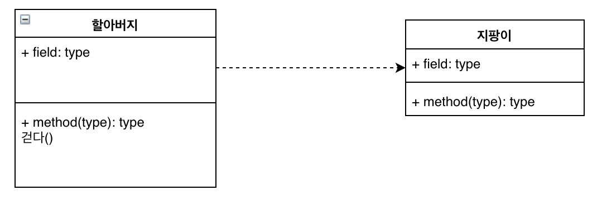

* 할아버지가 걷기 위해서는 지팡이가 필요하다. 할아버지는 지팡이에 의존하고 있기 때문에 이럴 때엔 점선으로 표시한다.

자판기 클래스 실습

```java
public class VendingMachineMain {
    public static void main(String[] args) {
        VendingMachine vm1 = new VendingMachine();
    }
}
```

```java
public class VendingMachine {
    // field (가지는 것들)
    // 생성자
    // method

}
```


VendingMachineMain 클래스의 main 메소드가 동작하려면 VendingMachine 클래스가 필요하다. 해당 클래스가 main 메소드 안에서 사용되고 있기 때문이다. main 메소드에서 VendingMachine을 사용하는데 그 클래스가 존재하지 않는다면 당연히 컴파일 오류가 발생할 것이다. 그래서 의존한다고 표현하고, 점선으로 그어준다.

또한 main 메소드는 String 클래스도 사용하고 있다. 이 말은 VendingMachineMain은 String 클래스에도 의존하고 있다는 뜻이다. String 클래스는 자바에서 기본 제공되는 클래스이기 때문에 잘 작동하는 것이다.

## 인스턴스 생성법 3가지

1. new 연산자와 생성자를 이용하여 인스턴스 생성
2. 클래스 로더를 이용 - 스프링 프레임워크 관련
3. 메모리에 있는 인스턴스를 복제(clone)하여 만드는 방법 - 거의 사용 X

> 인스턴스를 만들때마다 메모리에 할당되기 때문에 필요한 만큼만 인스턴스를 만들어야 한다.

## 객체지향의 핵심은 "메시징"

의도는 "메시징"이다. 훌륭하고 성장 가능한 시스템을 만들기 위한 핵심은 모듈 내부의 속성과 행동이 어떤가보다 모듈이 어떻게 커뮤니케이션하는 가에 달려있다. - Alan Curtis Kay

객체와 객체는 관계를 가지고 있고 커뮤니케이션이 이루어진다. 여기서 메시징이란 어떤 객체가 어떤 객체의 메소드를 호출하는 것이다. 따라서 객체 지향 프로그래밍을 한다는 것은 메소드가 언제 어떻게 호출되는가, 메소드의 이름은 어떻게 해야하가는가 등을 고민해야 하는 것이다.

### 객체는 자율적인 책임을 가진다.

자율적인 객체란 스스로 정한 원칙에 따라 판단하고 스스로의 의지를 기반으로 행동하는 객체다. 객체가 어떤 행동을 하는 유일한 이유는 다른 객체로부터 요청을 수신했기 때문이다. 요청을 처리하기 위해 객체가 수행하는 행동을 책임이라고 한다.

자율적인 책임의 특징은 객체가 어떻게 해야 하는가가 아니라 무엇을 해야하는가를 설명한다는 것이다.

> 객체지향의 사실과 오해 (위키북스, 조영호)

메시징은 객체가 어떤 객체가 다른 객체의 메소드를 호출하는 것이라고 했는데 이 글을 통해 객체가 어떤 행동을 하는 유일한 이유는 이 객체의 메소드를 다른 객체가 호출했을 때라는 것을 알 수 있다. 객체는 객체의 기능이 호출되었을 때 책임을 가지게 되는 것이다.

## 메소드 선언 방법

`[접근제한자] [static] return_type 메소드이름([매개변수, ...]) { ... }`

- 대괄호[]는 생략 가능하다
- 메소드 이름은 소문자로 시작하는 것이 관례

> 매개변수 vs 전달인자
>
> - 매개변수(parameter): 메소드 정의부분에 나열되어 있는 변수들
> - 전달인자(argument): 메소드를 호출할 때 전달되는 실제 값들

## static 메소드 (클래스 메소드)

static한 메소드는 인스턴스를 생성하지 않아도 호출할 수 있다.

```java
public class VendingMachine {
    public String pushProductButton(int menuId) {
        System.out.println(menuId + "를 전달받았습니다.");
        return "콜라";
    }
  
    public static void printVersion() {
        System.out.println("v1.0");
    }

}
```

pushProductButton 메소드는 `VendingMachine vm1 = new VendingMachine();`로 인스턴스를 생성 후에 사용할 수 있지만 static 메소드인 printVersion 메소드는 인스턴스 생성 없이 바로 `VendingMachine.printVersion();`으로 사용가능하다.

> static 메소드는 바로 알아보기 위해 관례상 클래스 명과 함께 사용한다.

## 메소드 실행 과정

자바에서 new를 하면 인스턴스가 생성되고 이 인스턴스는 Heap이라는 메모리 영역에 올라간다.

인텔리가 아닌 터미널에서 코드를 컴파일하고 실행하려면 다음과 같은 과정이 필요하다.

`javac VendingMachine.java`

`javac VendingMachineMain.java`

`java VendingMachineMain`

java 명령어는 JVM인데 어떻게 VendingMachineMain을 어디서 찾아서 실행하는 걸까?

javac를 이용해 컴파일을 하면 소스 파일이 있던 곳에 class 파일이 생성됐었다. 현재 폴더? out 폴더? 전부 아니다. 정답은 CLASSPATH 클래스 경로에서 main클래스를 찾아 실행한다. CLASSPATH가 .(점)인 경우 현재 경로에서 클래스를 찾게 되는 것이다. 현재 경로가 CLASSPATH로 잡혀있기 때문이다.

IntelliJ는 소스를 컴파일하고 out/production/프로젝트폴더 아래에 class 파일을 생성하는데 해당 폴더를 CLASSPATH로 인식하게 해준다.

```java
├── out
│   └── production
│       └── JAVA
│           └── practice
│               ├── VendingMachine.class
│               └── VendingMachineMain.class

```

IntelliJ가 java로 실행할 때 -classpath라는 옵션을 주는 것을 볼 수 있다.

`-classpath /Users/jus/dev/JAVA/out/production/JAVA practice.VendingMachineMain`

해당 옵션 뒤의 경로가 모두 CLASSPATH로 인식되는 것이다.

JVM이 클래스를 찾아서 읽어 들이고 읽어 들인 클래스 정보를 PERM이라는 메모리 영역에 저장한다. 인스턴스가 아닌 클래스 자체에 대한 정보가 PERM영역에 올라가는 것이다. 클래스 정보가 PERM영역에 올라가게 되면 JVM은 해당 클래스가 어떤 static 메소드를 가지고 있는지, 인스턴스 메소드를 가지고 있는지 모두 알게 된다.

JVM이 프로그램 시작점인 main 메소드를 찾아 실행해주면 Java Stack이라고 불리는 메모리 영역에 실행된 main메소드가 올라가게 된다. Stack은 FILO 자료구조로 먼저 들어간 자료가 나중에 나오는 구조이다.

> Java Stack에 저장된 메소드 실행정보 하나를 Stack Entry라고 한다.

Stack Entry안 main 메소드 안에 선언된 변수들도 Stack Entry에 저장되고 이렇게 메소드 안에서 선언된 변수를 local변수라고 한다. main 메소드의 argument인 String[] args 변수도 Stack Entry에 생성되게 된다.

main 메소드가 실행되면 Heap 메모리에 String배열 인스턴스가 만들어지고 이 인스턴스를 Stack Entry 안의 args 변수가 참조하게 된다.

> Stack Entry에는 프로그램 카운트라고 해서 몇번째 줄을 실행하고 있는지에 대한 정보도 기억하고 있다.

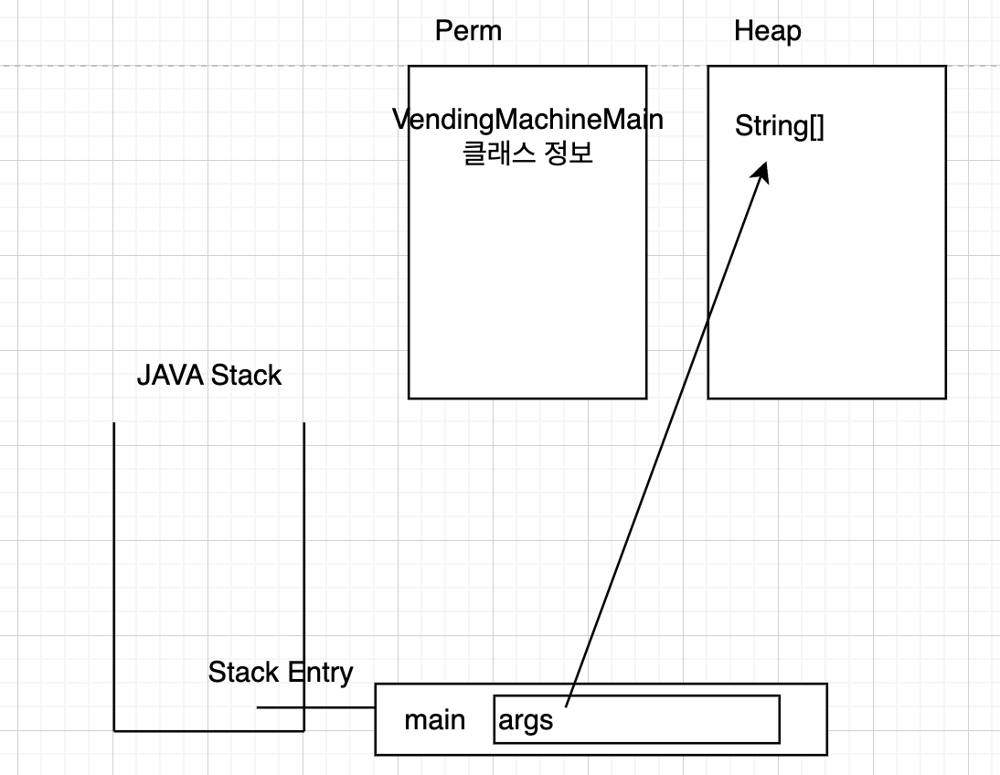

만약 JVM이 `VendingMachine.printVersion();` 코드를 만나면 printVersion() 메소드는 static 메소드이기 때문에 실행 가능하다고 판단하고 실행해주는 것이다. printVersion() 메소드가 실행되면 Java Stack에 스택 엔트리가 하나 더 추가된다.

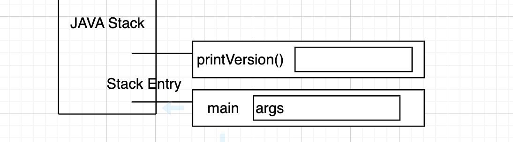

printVersion() 메소드가 실행 후에 종료가 되면 해당 메소드의 실행 정보를 담고 있는 스택 엔트리는 자바 스택에서 제거된다.

이후에 JVM이 new로 인스턴스를 생성하는 코드를 만나면 인스턴스를 Heap 메모리에 생성하고 vm 변수가 그 인스턴스를 참조하게 되는 것이다.

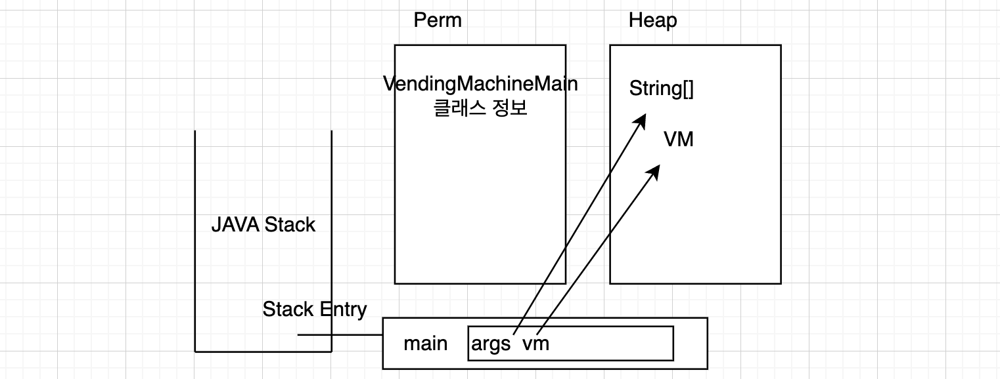

이후에 `vm.pushProductButton(100);` 코드를 만나면 Stack Entry에 pushProductButton이 생성되고 메소드 안에서 선언된 변수 menuId가 같이 생성된다.


이후에 코드가 다 실행되면 pushProductButton() 메소드가 종료되면서 자바 스택에서 제거된다. 이후 main 메소드도 종료되면서 자바 스택에서 제거된다. 자바 스택에는 더 이상 남아있는 스택 엔트리가 없게 되면서 프로그램이 종료된다.

메소드 안에서 선언된 변수는 지역변수이고, 지역변수는 메소드가 실행될 때 생성되고 종료될 때 사라진다. 같은 메소드를 동시에 열번 호출하면 그 메소드 안 지역변수들은 각각 다른 영역에 저장되어 사용되는 것이다. 따라서 동시에 메소드가 호출되어도 중복되는 문제가 발생하진 않는다.

---

`C c = new C();` C()는 생성자를 뜻한다.

C 클래스에 생성자가 없으면 컴파일 시점에서 자동으로 기본 생성자가 만들어진다.

기본 생성자

```java
public C(){}
```

## private

접근 제한자 private은 해당 클래스 안에서만 접근할 수 있도록 해준다. 만약 기본 생성자를 private로 바꿔준다면 그 클래스는 인스턴스를 못만들게 되는 것이다. 강제로 인스턴스를 못만들게 하고 싶으면 이 방법을 사용하면 될 것이다. 그렇게 되면 static이 붙은 메소드만 사용할 수 있게 된다.

## 클래스 메소드 vs 인스턴스 메소드

* 인스턴스 별로 다르게 동작해야 한다면 인스턴스 메소드
* static 메소드는 객체 생성이나 유틸리티 관련에서 사용될 때가 있다.
* 되도록 인스턴스 메소드를 사용한다.

인스턴스 메소드와 클래스 메소드를 잘 이해하려면 field에 대한 이해가 필요하다.

### 필드(field)

* 클래스가 가지는 속성 (사람 클래스의 필드: 이름, 생일 ...)
* 필드는 어떤 키워드와 함께 사용하느냐에 따라서 사용방법이 달라진다.
* static이라는 키워드가 함께 사용되는 필드는 클래스 필드, 아닌 경우는 인스턴스 필드라고 한다.

### 필드 선언 방법

`[접근제한자] [static] [final] 타입 필드명 [=초기값];`

대괄호[]는 생략가능

* 초기값이 없을 경우 참조형인 경우 null, boolean형일 경우 false, 기본형일 경우 0으로 초기화된다.

---

`String a = "안녕";`

문자열 String은 참조형 타입으로 인스턴스를 생성해서 참조해야할 것 같지만 문자열은 new를 사용하지 않고도 인스턴스를 사용할 수 있다. 되도록 new를 사용하지 말자.

## NullPointException

```java
String a;
System.out.println(a.length());
```

위 코드를 실행해보면 NullPointException 에러가 발생하며 프로그램이 종료된다. a가 아무것도 참조하지 않는 상태 즉, null값이므로 발생하는 에러이다.

## static 필드 (클래스 필드)

```java
public class Person {
    String name;
    static int count = 0;
}
```

```java
public class PersonTest {
    public static void main(String[] args) {
        Person p1 = new Person();
        Person p2 = new Person();

        System.out.println(p1.count);
        System.out.println(p2.count);
        p1.count++;
        System.out.println(p1.count);
        System.out.println(p2.count);

    }
}

```

[실행결과]

0
0
1
1

p1의 count를 증가시켰는데 p2의 count도 증가된 것을 볼 수 있다. 왜 그런걸까?

JVM은 CLASSPATH에서 클래스를 찾아 실행한다고 했다. `Person p1 = new Person()'`으로 Person 인스턴스를 생성하는데 인스턴스를 만들기 전에 JVM이 하는 일이 있다. 먼저 Person클래스가 CLASSPATH에 있는지 찾아보고 없으면 ClassNotFoundException 오류를 발생한다. Person 클래스를 찾으면 Person클래스 정보를 메모리에 올리게 된다.

여기서 중요한 것은 클래스 정보 자체는 정적이라는 것이다. 클래스 정보 자체는 실행되는 것이 아니기 때문이다. SSD나 하드디스크에 저장되어 있던 클래스를 읽어들여서 자바가 사용할 수 있는 메모리 영역에 그 정보를 올리는 것이다.

이때 클래스에 static한 필드가 있는지 살펴본다. static한 필드는 정적 영역에 따로 저장된다. Person이 가지고 있는 count변수는 별도로 저장되고 0으로 초기화되는 것이다. 따라서 count 변수는 인스턴스별로 각자 가지는 것이 아닌 정적 영역에서 따로 관리되는 것이다.

그래서 p1.count와 p2.count가 같은 메모리의 값을 출력하게 된 것이다.

> ! 인스턴스를 만들지 않아도 Person을 JVM이 읽어 들일 때 count 변수는 메모리에 따로 올라간다.
>
> 그래서 사실 count를 사용할 때에는 참조변수명.count가 아닌 클래스명.count로 사용하는 것이 좋다. `Person.count`

## 클래스 메소드에서 인스턴스 필드를 사용하지 못하는 이유

인스턴스 필드와 인스턴스 메소드는 인스턴스를 생성하지 않고 사용할 수 없다.

`java: non-static method printName() cannot be referenced from a static context`

반면 클래스 필드와 클래스 메소드는 JVM이 Person클래스 정보를 읽어 들일 때 이미 메모리에 올라간다. 인스턴스 필드와 메소드는 반드시 인스턴스를 생성 후 그 인스턴스를 참조하는 참조변수를 이용해서 접근해야 하기 때문에 메모리에 생성되는 시점이 달라서 클래스 메소드 안에서 인스턴스 필드를 사용할 수 없는 것이다. 클래스 메소드가 실행되는 시점에서는 인스턴스 필드가 메모리에 없어서 애초에 컴파일 오류가 발생된다.

`Non-static field '인스턴스 필드명' cannot be referenced from a static context`

> static한 필드는 클래스가 로딩될 때 딱 한번 메모리에 올라가고 초기화 된다!

## static 블록

클래스가 스태틱 영역에 배치될 때 실행되는 코드 블록으로 클래스 필드를 초기화할 수 있다.

```java
static int count;    // 클래스 필드
static{    // static 블록
    count=1000;
}
```

#### main 메소드보다 먼저 실행되는 static 블록

```java
public class PersonTest {
    static {
        System.out.println("static block");
    }
    public static void main(String[] args) {
        System.out.println("main block");
    }
}
```

[결과]

```plaintext
static block
main block
```

## 자바의 메모리 영역

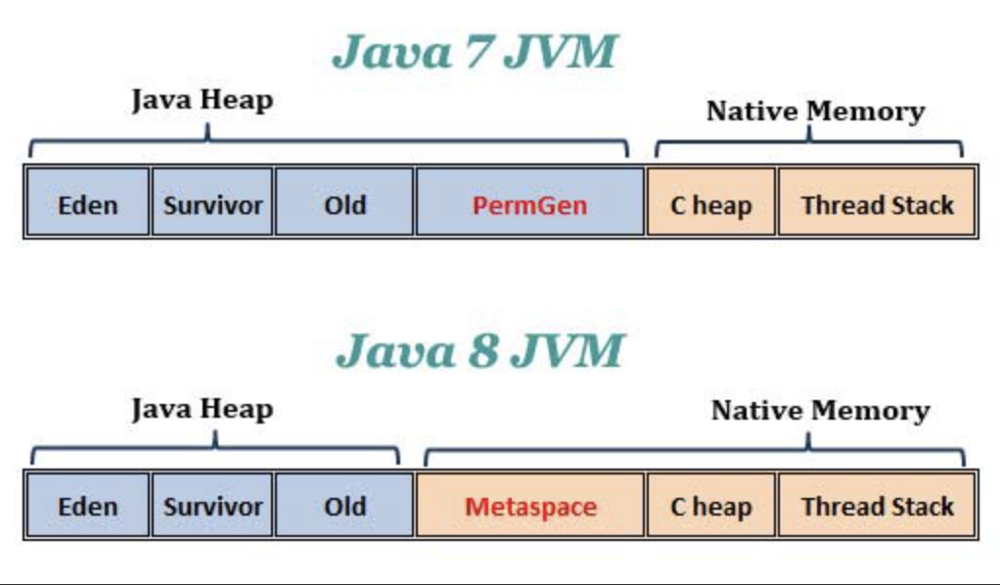

JAVA 8부터는 Metaspace 영역이 사용된다. Java Heap은 JVM이 관리하는 메모리 영역, Native Memory는 운영체제가 관리하는 메모리 영역이다.

JAVA 7까지는 JVM이 관리하는 메모리 영역인 PermGen에 클래스 정보가 올라갔었다. 8부터는 Metaspace에 올라간다.

클래스 파일 자체는 정적이다. JVM은 사용해야할 클래스의 정보를 읽어들여서 메모리에 올린다. 동적인 것들은 실행되면서 생성되는 것들을 말한다. 클래스가 저장된 HDD나 SSD는 Ram보다 속도가 느리기도 하고 매번 보조 기억장치에서 읽어들이는 건 성능을 저하시키는 원인이 된다. 따라서 클래스 정보는 처음 사용될 때 메모리에 그 정보를 올리고 필요할 때마다 사용한다.

```java
Person p1 = new Person();
Person p2 = new Person();
```

위 코드의 첫줄에서 Person을 처음 만나게 되면 이 클래스를 읽어 들여서 그 정보를 메모리에 올린 후 이를 이용해 인스턴스를 생성한다. 두번째 줄을 실행할 때에는 이미 메모리에 올라가 있는 Person 클래스 정보를 이용해 인스턴스를 생성하는 것이다.

#### static 정보는 어디에 저장?

Java 7전까지는 non-heap에 저장했고, 8부터는 heap에 저장한다.

## 추상화

중요한 것은 남기고, 불필요한 것은 제거한다!

고객 관리 프로그램을 만든다고 생각해보자. 고객은 같은 고객이어도 헬스장인지, 서점인지 등 어디 고객이냐에 따라 고객이 가져야 할 정보가 달라진다. 따라서 비지니스 영역(도메인 영역)에 맞춰서 고객을 추상화해야 한다.

너무 먼 미래까지 대비해서 클래스를 만들진 말고 딱 중요한 필요한 정보만을 가지도록, 기능도 필요한 것만 가지도록 추상화하면 된다.

## 캡슐화

관련된 것을 잘 몰아서 가지고 있는 것을 캡슐화라고 한다. 관련된 것을 잘 모아서 가지고 있을수록 응집도가 높다고 표현한다.

Math 클래스만 봐도 이름에서 딱 보이듯이 수학과 관련된 기능만 모아서 가지고 있다. 클래스 이름을 직관적으로 지어야 하는 이유!

만약 주소찾기 기능이 Math 클래스에 있다면 나중에 쓸 때 찾기 힘들 것이다.

## 좋은 객체 vs 나쁜 객체

좋은 객체는 응집도가 높고 결합도는 낮다!

객체는 어떠한 책임을 가지고 있다. 책임을 수행하는 데 필요한 기능들을 잘 모아서 가지고 있어야 응집도가 높아진다. 또한 다른 객체의 최소한의 도움으로 책임을 수행할수록 결합도가 낮아진다.

좋은 객체란 역할과 책임에 충실하면서 다른 객체와 잘 협력하여 동작하는 객체를 말한다. 반대로 나쁜 객체는 여러가지 역할을 한 가지 객체에 부여하거나, 이름과는 맞지 않는 속성과 기능을 가지거나, 제대로 동작하지 않는 객체를 말한다. 또한 다른 객체와도 동작이 매끄럽지 않은 객체는 나쁜 객체이다.

## 다형성

println() 메소드를 생각해보자. 이 메소드의 인자는 int, float, double, String 등이 될 수 있다. 중요한건 메소드 이름이 같다는 것이다. 어떤 타입의 인자를 출력하든 메소드 이름이 같다. 값이 뭐가되든 출력 후 줄 바꿈해주는 기능이므로 이름을 println()으로 정한 것이다.

PrintStream을 보면메소드 이름은 같지만 다양한 타입을 받아들이도록 여러 개가 선언되어 있다.

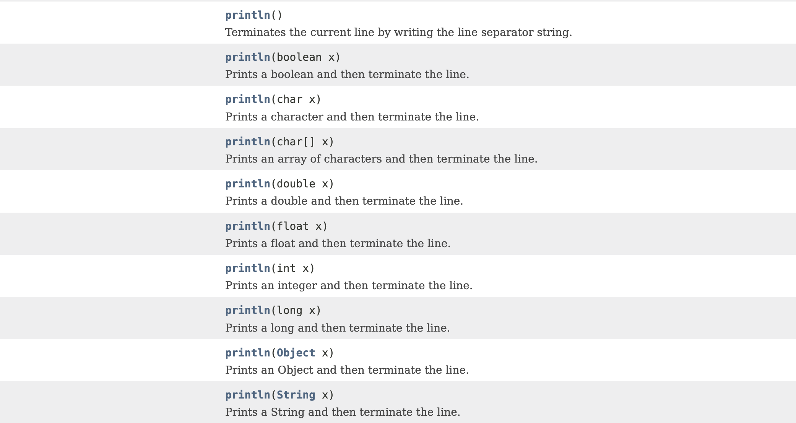

이렇게 같은 이름의 메소드가 여러 개 있는데 매개 변수의 타입이 다르거나 매개변수의 개수가 다른 경우를 Overloading 했다고 표현한다.

### 메소드 오버로딩(Overloading)

* 메서드의 이름은 같고 매개변수의 갯수나 타입이 다른 함수를 정의하는 것
* 리턴값만을 다르게 갖는 오버로딩은 작성할 수 없다.

같은 이름의 메소드 중 어떤 메소드가 실행될지는 JVM이 실행하면서 동적으로 결정하게 된다.

메소드 오버로딩을 통해 메소드를 사용할 때 타입과 관계 없이 필요한 기능을 가진 메소드의 이름만 외우면 되므로 훨씬 편리해진다. 이렇게 메소드를 같은 이름으로 사용하는 것을 다형성이라고 하고, 이것이 다형성이 중요한 이유이다.

> 객체를 만들땐 나는 어렵게 만들어도 사용하는 사람은 쉽게 쓸 수 있도록 만들어야 한다.

## Package

클래스는 패키지를 이용해 관련된 클래스들을 관리한다. 자바에서의 패키지는 폴더와 같다고 생각하면 된다.

클래스를 만들다 보면 클래스 수가 굉장히 많아지므로 관련있는 클래스들끼리 잘 모아놓는 것이 중요하다.

#### 패키지 이름 규칙

보통 도메인 이름을 거꾸로 적은 후 프로젝트 이름 등을 붙여서 만든다.

음악 파일이 매우 많다면 가수별로 폴더를 만들어도 되고 장르별로 폴더를 만들어서 관리할 수도 있다. 음악 듣는 사람의 취향에 따라 분류 기준이 달라진다. 클래스도 마찬가지로 어떤 기준으로 관련된 클래스들을 모을지가 중요하다.

> 프로그램의 패키지 구조는 아키텍쳐에 다라 달라진다. 아키텍쳐는 구조라고 생각하면 쉽다.

왜 도메인 이름을 거꾸로 적을까? 프로그래밍을 하다보면 오픈소스를 많이 사용하게 될 것이다. 다른 사람이 만든 클래스 중에 내가 만든 클래스와 이름이 같은 경우가 생긴다. 이 때 패키지 이름까지 같아버리면 충돌이 발생한다. 따라서 도메인 명을 거꾸로 적어서 패키지 명의 중복을 막는 것이다.

## 상속

OO는 OO다. OO는 OO의 종류 중 하나다. 라고 표현할 수 있다면 이것은 상속이다.

* 일반화시키기 (여러 종류의 객체를 하나의 이름으로 부를 수 있는 것)
  * TV는 전자제품이다.
  * 세탁기는 전자제품이다.
* 전자제품을 상속받은 TV, 세탁기는 모두 끄다(), 켜다() 메소드를 가진다.

상속 = 일반화 + 확장

* 부모클래스를 상속받는다는 것은 부모가 가진 것을 자식이 물려받아 사용할 수 있다는 것
* 좋은 객체란 응집도는 높이고 결합도는 낮추는 것이라 했는데 상속은 굉장히 강한 결합이므로 잘못 상속받으면 타격이 너무 크기에 반드시 써야만 할 때에 사용해야 한다.
* 최대한 상속을 쓰지 않도록 하자..!

#### 아무것도 상속받지 않으면 자동으로 java.lang.Object를 상속받는다

모든 클래스는 Object의 자손이다.(최상위 클래스)

## 다형성 - 메소드 오버라이딩(Overriding)

* 상위 클래스의 메서드를 하위 클래스가 재정의하는 것
* 메소드의 이름, 파라미터의 갯수, 타입이 동일해야 한다.

#### 메소드가 오버라이딩 되면 무조건 자식의 메소드가 실행된다!

```java
public class Car {
    public void run() {
        System.out.println("전륜구동");
    }
}
```

```java
public class Bus extends Car {
    @Override
    public void run() {
        System.out.println("후륜구동");
    }
}
```

```java
 public static void main(String[] args) {
        Bus b1 = new Bus();
        b1.run();

        Car c1 = new Car();
        c1.run();   

        Car c2 = new Bus();
        c2.run();   // 메소드가 오버라이딩되면 무조건 자식 메소드 실행!
    }
```

[실행결과]

```java
후륜구동
전륜구동
후륜구동
```

`Car c1 = new Bus();` 참조 타입을 Car로 하고 Bus 인스턴스를 생성했을 경우 Car 타입의 메소드인 run()만 사용이 가능하고 Bus의 다른 추가적인 메소드는 사용 불가능하다. 만약 사용하고 싶으면 다음과 같이 타입을 바꿔줘야 한다.

```java
Car c1 = new Bus();
c1.run()
Bus b1 = (Bus)c1;
b1.안내방송();
```

이것이 가능한 이유는 c1이 참조하는 것이 Bus 인스턴스이기 때문에 이걸 Bus 타입으로 변환해서 b1이 참조하게 했기 때문이다.

## 필드, 메소드 오버라이딩 시 주의점

필드는 Type을 따라가고 메소드는 오버라이딩된 자식의 메소드가 실행된다!

```java
public class Parent {
    int i = 5;
    public void printII() {
        System.out.println(i * 2);
    }
    public void printI() {
        System.out.println("parent - printI(): " + i);
    }
}

```

```java
public class Child extends Parent {
    public int i = 15;      // 필드 오버라이딩
    public void printI() {      // 메소드 오버라이딩
        System.out.println("child - printI(): " + i);
    }
}
```

```java

public static void main(String[] args) {
        Parent p1 = new Parent();
        System.out.println(p1.i);
        p1.printI();
        p1.printII();

        System.out.println("-------------------------");
        Child c1 = new Child();
        System.out.println(c1.i);
        c1.printI();
        c1.printII();

        System.out.println("-------------------------");
        Parent p2 = new Child();
        System.out.println(p2.i);       // 필드는 타입을 따라가고
        p2.printI();                    // 메소드는 자식 메소드를 따라간다
        p2.printII();
    }
```

[실행결과]

```java
5
parent - printI(): 5
10
-------------------------
15
child - printI(): 15
10
-------------------------
5
child - printI(): 15
10
```

#### 정보 은닉(information hiding)은 객체지향의 중요한 기법이다. 중요한 필드는 은닉해서 외부에서 직접 접근할 수 없도록 하고, 필드는 메소드를 통해서만 접근해서 사용하도록 코딩해야 한다.

* 위 코드의 경우 `System.out.println(c1.i);` 같은 코드가 필드에 직접 접근하는 코드이므로 좋지 않다.

## Getter & Setter 프로퍼티

private로 필드를 은닉화했을 때 이 필드의 값을 수정하고 얻기 위해 Getter, Setter 메소드를 사용한다.

```java
public class Book {
    private String title;   // field price
    private int price;

    // setter, getter - 프로퍼티(property)
    public String getTitle() {
        return title;
    }

    public void setTitle(String title) {
        this.title = title;
    }

    public int getPrice() {
        return price;
    }

    public void setPrice(int price) {
        this.price = price;
    }
}

```

* getter, setter는 프로퍼티이다. 위 코드에서는 title 프로퍼티, price 프로퍼티 총 2개의 프로퍼티가 존재

> this는 내 자신 인스턴스를 참조하는 예약어로 클래스 메소드에서는 사용이 불가능하다.(메모리에 생성되는 시점이 다르므로)

## 오버라이딩하라고 만든 Object의 메소드

Object가 오버라이딩하라고 제공하는 메소드

* toString()
* equals() & hashCode()

```java
    public static void main(String[] args) {
        Car c1 = new Car();
        System.out.println(c1); 
    }
```

[실행결과]

`Car@7c75222b`

Syste.out의 println 메소드들을 보면 print(Object x)가 있다. 위의 경우 Object 인자를 받아 출력한 경우이다. 부모타입의 변수로 자식 인스턴스를 참조할 수 있고, 조상 타입의 변수로도 후손 인스턴스를 참조할 수 있다고 했었다. Object는 모든 클래스의 조상이므로 가능한 것이다.

```java
public class PrintStream extends FilterOutputStream
    implements Appendable, Closeable
{
    ...

    public void println(Object x) {
        String s = String.valueOf(x);
        synchronized (this) {
            print(s);
            newLine();
        }
    }

    ...
}
```

실제로 println(Object x) 코드를 까보면 Object x를 받아서 문자열로 만들어준 후 문자열을 받는 print()로 넣어준다.

valueOf()를 또 따라 들어가 보면 obj가 null이면 "null"을 아니면 obj의 toString() 값을 리턴해주고 있다.

```java
public static String valueOf(Object obj) {
        return (obj == null) ? "null" : obj.toString();
    }
```

즉, println(Obejct x)는 Object x의 toString()값을 출력해주는 것이다.

toString()을 오버라이딩 해주면 원하는 출력 형태로 출력할 수 있게 된다.

#### equals 메소드는 값을 비교하는 기준이 필요하기 때문에 오버라이딩이 필요하다.

> hashCode()
>
> * hash 코드를 만들어내는 기능
> * 값이 같은지 비교하는 기능

## 생성자

* 인스턴스를 생성할 때 사용
* 리턴타입 없이 클래스와 같은 이름으로 생성
* 클래스 작성 시 생성자를 하나도 만들지 않으면 자동으로 기본 생성자 생성
  * 기본생성자 : 매개변수를 하나도 받지 않는 생성자

이름을 가지고 인스턴스가 만들어지도록 하려면 다음과 같이 생성자를 만들어줘야 한다.

```java
private String name;    // 필드

public Car(String name) {
    this.name = name;    // 인스턴스의 필드(이름)을 전달받은 name으로 설정
}
```

이제는 생성자를 만들어줬기 때문에 기본생성자는 만들어지지 않는다. 따라서 다음 코드는 에러가 발생한다.

```java
Car c1 = new Car();
```

> 불변객체란?
>
> 생성자에서 넣어준 값(은닉화된 값)을 반환해주는 즉, getter 기능만 가지고 있는 객체를 불변 객체라고 한다. 객체를 생성할 때 값을 가지게 한 후 외부에 전달할 때 사용한다. 누군가가 그 객체의 값을 바꾸지 못하도록 할 수 있는 것이다.
>
> 대표적인 불변객체: String - 문자열이 불변객체라는 것은 String이 가지고 있는 모든 메소드는 String 내부의 값을 변화시키지 않는다.

#### 생성자가 여러개인 경우 - 생성자 오버로딩

```java
public class Person {
    private String name;
    private String email;
    private String password;

    public Person(String name, String email) {
        this.name = name;
        this.email = email;
    }

    public Person(String name, String email, String password) {
        this.name = name;
        this.email = email;
        this.password = password;
    }
}

```

생성자가 여러개인 경우 생성자 오버로딩을 통해 선언하면 된다. 생성자는 매개변수의 개수가 다르거나, 타입이 다르다면 여러개를 가질 수 있다.

> 여러개를 만들면 만드는 사람은 힘들지만 쓰는 사람은 편리하기에 클래스를 만들 때는 사용하는 사람 입장에서 만들어야 한다.

그런데 보면 중복되는 코드가 생긴다. 이 코드를 줄이기 위해 생성자 안에서 자기 자신을 호출할 수 있다.

```java
public class Person {
    private String name;
    private String email;
    private String password;

    public Person(String name, String email) {
        this(name, email, null);    // 자신의 생성자를 호출해서 중복 제거
    }

    public Person(String name, String email, String password) {
        this.name = name;
        this.email = email;
        this.password = password;
    }
}
```

파라미터를 많이 받는 생성자를 this로 호출해야 편리해진다!

#### this 생성자

* 인스턴스 자기 자신을 참조할 때 사용하는 키워드
* this() 생성자는 자기 자신의 생성자를 뜻한다.
* this() 생성자는 생성자 안에서만 사용 가능하고, super() 생성자를 호출하는 코드 다음이나, 맨 첫번째 줄에 위치해야 에러가 나지 않는다.

### 생성자 super() - 부모의 생성자 호출

* 인스턴스 부모를 참조할 때 사용
* super() 생성자는 부모 생성자를 의미하고, 생성자 안에서만 사용 가능하고 첫번째 줄에만 올 수 있다.
* 생성자는 무조건 super() 생성자를 호출해야 한다. 사용자가 super() 생성자를 호출하는 코드를 작성하지 않았다면 자동으로 부모의 기본 생성자가 호출된다.
* 부모클래스가 기본 생성자를 가지고 있지 않다면, 사용자는 반드시 직접 super() 생성자를 호출해야 한다.

```java
public class Car {
    public Car() {
        System.out.println("Car() 생성자 호출");
    }
}

public class Bus extends Car {
    public Bus() {
    }
}
```

```java
public static void main(String[] args) {
        Car c1 = new Car();

        Bus b1 = new Bus();
    }
```

[결과]

```java
Car() 생성자 호출
Car() 생성자 호출
```

Bus() 생성자를 호출해도 Car()이 호출된다. 이유는 자식 클래스인 Bus의 생성자는 자동으로 부모 클래스의 생성자인 super()를 호출하기 때문이다.

```java
public class Car {
    public Car() {
        // super();    // 자동으로 들어간다.
        System.out.println("Car() 생성자 호출");
    }
}

public class Bus extends Car {
    public Bus() {
        // super();    // 자동으로 들어간다.
    }
}
```

여기서 Bus클래스의 생성자에 다른 출력 코드를 추가하면 어떻게 될까?

```java
public class Bus extends Car {
    public Bus() {
        // super();    자동으로 들어간다.
        System.out.println("Bus 생성자 호출"):
    }
}
```

[결과]

```java
Car() 생성자 호출
Car() 생성자 호출
Bus 생성자 호출
```

부모 생성자 호출 코드인 super() 코드가 먼저 실행되고 다음 출력 코드가 실행된다.

만약 부모 클래스의 생성자가 기본생성자가 아니라 name을 받는 생성자라면 자식 클래스인 Bus 클래스에서 꼭 super() 생성자를 호출해줘야 한다.

```java
public class Car {
    public Car(String name) {
        System.out.println("Car() 생성자 호출: " + name);
    }
}

public class Bus extends Car {
    public Bus() {
        super("자동차");
        System.out.println("Bus 생성자 호출");
    }
}
```

[결과]

```java
Car() 생성자 호출: 차
Car() 생성자 호출: 자동차
Bus 생성자 호출
```

## 추상클래스

* 인스턴스가 될 수 없는 클래스로 상속받는 자손이 인스턴스가 된다.
* abstract 키워드를 사용하여 클래스를 정의하고, 보통 1개 이상의 추상 메소드를 가진다.
  * `public abstract class 클래스명 { ... }`

추상 클래스 Car는 run() 메소드가 필요하다. 이 run()를 자동차마다 다르게 구현해야 할 때 추상메소드를 사용하면 된다.

```java
public abstract class Car {
    public Car(String name) {
        System.out.println("name: " + name);
    }

    public abstract void run();
}
```

이렇게 추상메소드로 만들어두면 Car 클래스를 상속받은 자식 클래스들은 필수적으로 부모클래스가 가진 추상메소드를 오버라이딩해야 한다. 당연히 부모의 기본 생성자가 없기 때문에 반드시 super()를 호출해줘야 한다.

```java
public class Bus extends Car {
    public Bus() {
        super("Bus!!");
    }

    @Override
    public void run() {
        System.out.println("버스 run");
    }
}

public class Taxi extends Car {
    public Taxi(String name) {
        super(name);
    }

    @Override
    public void run() {
        System.out.println("택시 run");
    }
}
```

그렇다면 만약 `Car c = new .....;` ....부분의 코드를 가려져있다고 가정하고 c.run();을 하면 어떤 결과가 나올까?

Car는 추상클래스이기 때문에 `Car c = new Car();` 이 불가능하다. Car의 자식클래스인 Bus나 Taxi만 가능할 것이다. 따라서 어떤 인스턴스냐에 따라 run()메소드가 다른 결과를 나타낼 것이다. 컴파일러가 ...부분의 코드를 모른다면 실행되기 전까지는 run 메소드의 결과를 알 수 없다.

> 이렇게 자바처럼 실행한 후에 결과를 알 수 있는 언어를 동적인 언어라고 한다.

```java
        Car[] arr = new Car[2];
        arr[0] = new Bus();
        arr[1] = new Taxi("Taxi!!");
        for (Car c : arr) {
            c.run();
        }
```

[결과]

```java
name: Bus!!
name: Taxi!!
버스 run
택시 run
```

이렇게 버스와 택시를 모두 Car 추상클래스로 일반화 시켜서 사용할 수 있다. Car[] 배열은 자동차의 배열이라고 생각하기보다 자동차 후손들의 배열이라고 생각하면 좋다. 일반화 시켜서 여러 객체를 하나인 것처럼 다룰 수 있다. (추상클래스 + 배열)

## 추상클래스 - 템플릿 메소드 패턴

추상 클래스를 가장 많이 사용하는 경우는 템플릿 메소드 패턴이다.

> 템플릿 메소드 패턴이란 특정 작업을 처리하는 일부분을 서브 클래스로 캡슐화하여 전체적인 구조는 바꾸지 않으면서 특정 단계에서 수행하는 내용을 바꾸는 패턴으로 전체적으로는 동일하면서 부분적으로는 다른 구문으로 구성된 메서드의 코드 중복을 최소화 할 때 사용한다.

#### 템플릿 메소드 패턴의 예

여러 종류의 Controller를 만든다고 가정하자. 모든 Controller는 초기화-실행-마무리 단계로 구현되는데 초기화와 마무리 과정의 코드는 모두 동일하고 실행 단계의 코드만 Controller에 따라 달라진다. execute() 함수를 통해 자신이 가진 메소드들을 순서대로 호출하게 해서 초기화-실행-마무리 단계를 진행하도록 했다.

```java
public abstract class Controller {
    public void init() {
        System.out.println("초기화");
    }

    public void close() {
        System.out.println("마무리");
    }

    // Controller마다 매번 달라지는 코드
    public abstract void run();

   
    public void execute() {
        // 초기화
        this.init();
        // 실행
        this.run();
        // 마무리
        this.close();
    }
}


public class FirstController extends Controller {
    @Override
    public void run() {
        System.out.println("실행 코드: 1");
    }
}

public class ControllerMain {
    public static void main(String[] args) {
        Controller c1 = new FirstController();
        c1.execute();
    }
}
```

[결과]

```java
초기화
실행 코드: 1
마무리
```

이렇게 Controller를 상속받게 해서 매번 변화하는 코드만 구현하도록 강제했다. 그런데 템플릿 메소드는 이게 다가 아니다. 사용자가 실수로 전체 과정을 실행하는 execute() 메소드가 아닌 초기화 실행 메소드 init()만 호출했다면 문제가 된다.

init(), run(), close() 메소드는 사용자가 직접 호출하는 게 아닌 사용자가 호출한 execute()에 의해 호출되어야 한다. 서로 다른 패키지에 있다고 가정하고 init(), run(), close() 메소드의 접근제한자를 protected로 설정한다.

> 접근제한자 protected
>
> 같은 패키지이거나 상속받았을 경우 접근 가능하다.

이렇게 해주면 다른 패키지에 있는 ContollerMain에서는 init(), run(), close() 호출이 불가능하고, 상속받은 FirstController에서는 패키지가 달라도 상속받았으므로 호출이 가능해져서 run() 메소드 오버라이딩이 가능해진다.

하지만 FirstController에서 실수로 init() close() 메소드를 접근해서 수정하게 될 수도 있으므로 부모클래스 Controller에서 init()과 close() 메소드를 final로 구현해야한다. final이 붙은 메소드는 오버라이딩이 금지돼서 다른 클래스에서 바꿀 수 없게 되므로 문제를 방지할 수 있다.

```java
public abstract class Controller {
    protected final void init() {
        System.out.println("초기화");
    }

    protected final void close() {
        System.out.println("마무리");
    }

    protected abstract void run();

    public void execute() {
        // 초기화
        this.init();
        // 실행
        this.run();
        // 마무리
        this.close();
    }
}
```

## 부모가 될 수 없는 final 클래스

* 상속을 금지 시키려면 클래스를 정의할 때 final 키워드를 사용한다.
* `public final class 클래스명 { ... }`
* 대표적인 final 클래스가 String 클래스이다.

String은 불변객체이다.

```java
String s1 = "hello";
        String s2 = "hello";
        String s3 = new String("hello");
        String s4 = new String("hello");

        if(s1 == s2)
            System.out.println("1:" + s1 == s2);
        if(s1 == s3)
            System.out.println("2:" +s1 == s3);
        if(s3 == s4)
            System.out.println("3:" +s3 == s4);
```

[결과]

```java
1: true
```

String을 new로 생성하지 않은 경우는 상수로 취급한다. 그래서 s1과 s2는 같은 것을 참조해서 1번 케이스가 true가 나온 것이다. s3와 s4는 new로 생성했기 때문에 new는 매번 새롭게 메모리에 영역을 차지한다.

> ==는 값이 같냐를 물어보는 것이 아닌 같은 것을 참조하느냐? 이다. 값을 비교할 때에는 equals 메소드를 사용한다.

```java
// 값이 동일한 지를 비교할 때에는 equals
        if(s1.equals(s2))
            System.out.println("s1과 s2의 값이 같다.");
  
        String s = s1.toUpperCase();    // 대문자 변환 메소드
        System.out.println(s);
        System.out.println(s1);
```

[결과]

```java
s1과 s2의 값이 같다.
HELLO
hello
```

String은 불변객체이기 때문에 최초로 한번 생성되변 절대 자기 자신의 값을 변경하지 않는다. 따라서 s1은 계속 같은 값을 출력한다.

#### String이 불변객체인 이유?

1. 메모리 절약

Java 디자이너는 가장 많이 사용되는 데이터 타입이 String이라 가장 많은 메모리를 차지할 것을 예측했기 때문에 최적화를 위해 String Pool에 리터럴을 포함하여 String 객체를 공유하고, 일시적으로 생성된 String 객체를 줄여줬다.

> 리터럴이란 변수에 넣는 변하지 않는 데이터(값)을 의미한다.

이때 가변 객체는 공유가 불가능하기 때문에 공유를 위해 불변객체로 만든 것이다.

만약 String "hello"를 100번 출력한다고 생각해보자. String의 불변성이 없다면 String Pool을 통한 String 객체를 공유할 수 없게 되고, "hello" String 객체를 100개 만들게 되어 메모리 낭비를 하게 된다.

하지만 String이 불변객체이기 때문에 "hello" String 객체는 Heap 영역에 단 하나만 생성되어 공유된다.

2. 보안상의 이유

네트워크 연결 시 호스트 및 포트가 String으로 되어 있고, 파일이나 디렉토리 경로도 String으로 되어 있으며 DB 연결에 필요한 URL도 String으로 되어있다.

String이 불변하지 않다면 사용자는 시스템의 특정 파일에 대한 엑세스 권한을 얻은 후 Path의 변경이 가능하게 되어 보안상의 문제가 발생할 수 있다.

3. Hash

String은 HashMap, Hashtable 같은 해시 기반 컬렉션의 키로써 많이 사용되기 때문에 동일한 값으로 저장된 객체의 value를 검색할 수 있도록 불변한 것이 중요하다.

키로 지정된 String의 내용이 수정되면 삽입 및 검색 시 두 개의 다른 해시 코드를 생성하게 되므로 맵에서 값 객체를 잃게 될 것이다.

#### String과 비슷하지만 내부가 변하는 StringBuffer 클래스

StringBuffer 클래스는 객체의 공간이 부족해지는 경우 버퍼의 크기를 유연하게 늘려준다. (mutable. 가변)

String은 내부의 문자열을 수정할 수 없기에 수정하고 싶으면 새로운 문자열을 만들어 리턴해야 한다. 그래서 문자열을 합쳐주는 +와 같은 연산자를 많이 사용하면 할수록 객체 수가 늘어나 프로그램 성능이 저하된다.

따라서 문자열을 변경하는 작업이 많을 경우 String을 사용하는 것보다 StringBuffer 클래스를 사용하는 것이 좋다. String Buffer 클래스는 내부 Buffer에 문자열을 저장해두고 그 안에서 추가, 수정, 삭제 작업을 할 수 있도록 설계되어 있다.

> Buffer: 데이터를 임시로 저장하는 메모리

그러나 StringBuffer를 생성할 경우 buffer의 크기를 초기에 설정해야 하므로 생성 속도가 많이 느리다. 마찬가지로 문자열 수정 시에도 buffer의 크기를 조절하고 명칭을 변경해야 하는 내부적인 연산이 필요해서 많은 양의 문자열 수정이 아니라면 String 객체를 사용하는 것이 오히려 나을 수도 있다.

> 단순 조회 연산은 String 객체가 빠르다.

## 접근제한자

.png)

private 클래스는 언제 사용할까? 메소드를 구조적으로 나누고 싶을 때!

메소드가 길어지면 구조를 파악하기 힘들다.

## 인터페이스

설계를 할 때에는 구현부터 하는 것이 아닌 무슨 기능을 만들어야 할 지 부터 고민해야 한다. 만들어야 할 기능들을 관련된 것끼리 묶은 후 이름을 지어줘서 응집도를 높인다.

요구사항에는 기능적 요구사항, 비기능적 요구사항이 있다.

* 기능적 요구사항: 회원가입 기능, 글쓰기 기능 ...
* 비기능적 요구사항: 첫 페이지 안에 최소 3초 안 보여주기, 인터넷 환경...

> 비기능적 요구사항을 맞춰 설계를 하려면 그 조건을 만족하는 아키텍쳐가 필요하다.

결론적으로 구현은 항상 나중이다. 뭘 구현해야하는 지부터 고민하고 설계해야 한다. 만들어야할 기능들을 묶어서 이름을 지어주는데 이걸 인터페이스라고 한다.

인터페이스: 기능들의 목록

```java
[public] interface 인터페이스이름 { ... }
```

* 인터페이스는 구현은 없고 선언만 존재한다.
* 모든 필드는 public static final이어야 하며, 모든 메소드는 public abstract이어야 한다. (final, abstract 생략시 자동으로 붙음)
* 자바8부터는 default와 static 메서드 선언도 가능하다.
* 추상메소드만 가지고 있기 때문에 추상클래스와 마찬가지로 new로 인스턴스를 생성할 수 없다. 그저 필요한 기능만 나열해둔 껍데기이다. 구현을 안해도 필요한 기능을 to-do-list처럼 적어둔 것 뿐이다.

[로또 기계 실습]

```java
/*
1. 1~45까지 써있는 Ball을 로또 기계에 넣는다.
2. 로또 기계에 있는 Ball들을 섞는다.
3. 섞인 Ball중 6개를 꺼낸다.
 */
public interface LottoMachine {
    public static int MAX_BALL_COUNT = 45;
    public static int RETURN_BALL_COUNT = 6;
  
    // 45개 Ball 받기
    public abstract void setBalls(Ball[] balls);

    // Ball 섞기
    public abstract void mix();

    // 6개 Ball 반호나
    public abstract Ball[] getBalls();
}

```

> 여기서 변수 앞 public static과 메소드 앞 abstract는 생략 가능하다.

Ball 객체는 숫자를 가지고 있고 이 숫자는 생성될 때 초기화되며 불변하다. 따라서 생성자에서 초기값을 넘겨서 필드를 초기화해주고 값을 리턴만 해주는 불변 객체로 설계해야 한다.

```java
// 생성자에서 초기값을 넘겨서 필드를 초기화해주고 값을 리턴만 해주는 것을 불변 객체라고 했다.
public class Ball {
    private int number;    // 외부에서 변경할 수 없도록 private

    // 공은 생성될 때부터 숫자를 가지고 태어나고 바뀌면 안된다. - 불변
    public Ball(int number) {
        this.number = number;
    }
  
    // 외부에 숫자를 알려주기 위해 getter 생성
    public int getNumber() {
        return number;
    }
}
```

LottoMachineImpl

```java
public class LottoMachineImpl implements LottoMachine {
    private Ball[] balls;
    @Override
    public void setBalls(Ball[] balls) {
        this.balls = balls;
    }

    @Override
    public void mix() {
        for (int i = 0; i < 10000; i++) {
            // Math.random()은 0.0 <= x <= 1.0
            int x1 = (int)(Math.random() * LottoMachine.MAX_BALL_COUNT);
            int x2 = (int)(Math.random() * LottoMachine.MAX_BALL_COUNT);
            if (x1 != x2) {
                Ball tmp = balls[x1];
                balls[x1] = balls[x2];
                balls[x2] = tmp;
            } // if
        } // for
    }

    @Override
    public Ball[] getBalls() {
        Ball[] result = new Ball[LottoMachine.RETURN_BALL_COUNT];
        for (int i = 0; i < LottoMachine.RETURN_BALL_COUNT; i++) {
            result[i] = balls[i];
        }
        return result;
    }
}

```

Main 클래스

```java
public class LottoMachineMain {
    public static void main(String[] args) {
        // Ball 인스턴스를 45개 참조할 수 있는 배열 생성
        // 아직 Ball 인스턴스를 생성한 것이 아닌 Ball을 참조할 수 있는 참조변수 45개를 만든 것이다.
        Ball[] balls = new Ball[LottoMachine.MAX_BALL_COUNT];
        for (int i = 0; i < LottoMachine.MAX_BALL_COUNT; i++) {
            balls[i] = new Ball(i + 1);
        }

        // LottoMachine 인스턴스 생성
        LottoMachine lottoMachine = new LottoMachineImpl();
        lottoMachine.setBalls(balls);
        lottoMachine.mix();
        Ball[] result = lottoMachine.getBalls();

        // 당첨 공번호 출력
        for (int i = 0; i < result.length; i++) {
            System.out.println(result[i].getNumber());
        }
    }
}

```

### JDK 8부터 추가된 인터페이스의 default method

A라는 인터페이스가 2개의 메소드를 가지고 오픈소스로 공개되었다. 사람들이 이 인터페이스를 구현해서 클래스들을 구현했다. 그런데 A 인터페이스 개발자가 추가 기능이 필요하다고 판단해 메소드 하나를 추가하여 버전 업을 했다. A 인터페이스를 사용한 사람들도 같이 버전업했을 경우 잘 동작하던 클래스들이 추가된 메소드 때문에 에러가 발생할 것이다.

A 인터페이스에 메소드 하나 추가했을 뿐인데 A 인터페이스를 구현한 수많은 클래스들이 다 먹통이 되는 문제가 발생한다. 이런 경우를 대비해 Java 8부터 기능이 추가됐다. A 인터페이스에 나중에 추가한 메소드를 default 메소드로 구현할 수 있게 했다. 인터페이스는 원래 메소드를 선언만 할 수 있었는데 구현까지 가능해진 것이다. 이러면 버전업이 되더라도 추가된 메소드는 그냥 상속받듯이 구현한 클래스들이 사용할 수 있게 된다. 원한다면 메소드 오버라이딩까지 가능해졌다.

### JDK 8부터 추가된 인터페이스의 static method

인터페이스를 구현한 클래스가 없어도 사용가능한 static method가 추가됐다. 인터페이스를 구현한 클래스가 없더라도 (인터페이스명).(static method명)으로 사용 가능해졌다.

## 팩토리 메소드 패턴

공장이 하는 일은 복잡한 생산 과정을 거치고 제품을 생산하는 것이다. 사용자 입장에서 그 공장이 어떤 생산 과정을 거치는 지 몰라도 결과만 받아 이용하면 된다. 이렇게 객체의 생성되는 과정을 숨겨주는 패턴을 팩토리 메소드 패턴이라고 한다.

기존에는 `Bus b1 = new Bus();` 로 Bus 인스턴스를 생성했는데 팩토리 메소드 패턴을 통해 다음과 같이 생성 과정을 숨기고 생성할 수도 있다. 생성 과정을 BeanFactory에 맡겨서 생성한 예이다.

```java
public class BeanFactory {
    // 2. 자기 자신 인스턴스 참조하는 static한 필드 선언.
    private static BeanFactory instance = new BeanFactory();

    // 1. private 생성자. 외부에서 인스턴스 생성 불가
    public BeanFactory() {
    }

    // 3. 2번에서 생성한 인스턴스를 반환하는 static한 메소드 생성
    public static BeanFactory getInstance() {
        return instance;
    }

    public Bus getBus() {
        return new Bus();
    }
}

```

```java
public class BeanFactoryMain {
    public static void main(String[] args) {
        BeanFactory bf1 = BeanFactory.getInstance();

        Bus b1 = bf1.getBus();
        Bus b2 = bf1.getBus();

    }
}

```

## 클래스 로더를 이용해 인스턴스 생성

인스턴스를 생성할 때 new 명령어를 이용해 만들었는데 클래스 로더를 이용해서도 생성할 수 있다.

```java
Class clazz = Class.forName("클래스풀네임");
Object obj = clazz.newInstance();
```

[가정]

1. Bus와 SuperCar 클래스 모두 a() 메소드를 가지고 있다
2. a() 메소드를 실행할 수 있도록 코드를 작성해야 하는데 아직 어떤 클래스인지 모른다.
3. 이 클래스 이름은 나중에 알게 될 것이다.
4. a() 메소드를 실행할 수 있도록 코드를 작성해야 한다.

이럴때 사용하는 것이 클래스로더이다.

JVM은 클래스를 CLASSPATH에서 찾는다고 했다. `Class.forName("클래스이름")`은 클래스명으로 바로 썼으니까 static한 메소드인데 클래스이름에 해당되는 클래스를 CLASSPATH에서 읽어들인다.

```java
String className = "practice.Bus";
Class clazz = Class.forName(className);
Method[] declaredMethods = clazz.getDeclaredMethods();
for (Method m : declaredMethods) {
    System.out.println(m.getName());
}
```

[결과]

```java
b
c
a
```

clazz는 forName으로 찾은 클래스를 가리킨다. getDeclaredMethods()로 가지고 있는 메소드들을 하나씩 꺼내서 출력해준 것이다.

```java
        String className = "practice.Bus";
        Class clazz = Class.forName(className);
        Object o = clazz.newInstance();
  
        Bus b = (Bus) o;
        b.a();
```

위부터 세줄의 코드는 `Object o = new Bus();` 와 같은 코드이다.

만약 여기서 className을 SuperCar로 바꿔준다면 Bus로 형변환하는 과정에서 ClassCastException이 발생할 것이다.

만약 두 클래스의 a() 메소드를 전부 사용하고 싶다면 두 클래스의 부모인 Car 클래스를 만들고 상속받게 해서 o를 Car 타입으로 형변환을 해주면 된다.

```
Car b = (Car) o;
````

이러면 클래스 이름이 어떻게 되던 부모 타입으로 생성하므로 에러없이 사용 가능하다.

이번엔 Car를 상속받지 않은 상관없는 메소드 Hi의 a() 메소드를 실행해보자

```java
        String className = "practice.Hi";
        Class clazz = Class.forName(className);
        Object o = clazz.newInstance();

        // a() 메소드 정보를 가지고 있는 Method 반환
        Method m = clazz.getDeclaredMethod("a", null);
        // Object o가 참조하는 객체의 m 메소드를 실행
        m.invoke(o, null);
```

className을 Bus나 SuperCar로 바꿔줘도 잘 실행된다.

**이 과정을 통해 얻을 수 있는 사실은 문자열로 된 클래스명과 문자열로 된 메소드명만 가지고도 표현할 수 있는 방법이 있다는 것이다! 나중에 서블릿이나 스프링에서 내부적으로 사용하는 기술이다.**

## 익명 클래스 (Anonymous Class)

`new 생성자() { ... }` 생성자 뒤에 중괄호가 나오고 보통 코드를 오버라이딩해 구현한다.

```java
        Car c1 = new Car() {
            @Override
            public void a() {
                System.out.println("이름없는 객체의 a()메소드 오버라이딩");
            }
        };
```

원래라면 추상클래스인 Car는 인스턴스를 생성할 수 없지만 익명 클래스로 구현할 수 있다.

인터페이스도 원래는 인스턴스를 생성할 수 없지만 익명클래스로 생성해서 실행할 수 있다.

```java
    public static void main(String[] args) {

        RunnableExecute runnableExecute = new RunnableExecute();
        System.out.println("---------------------------");
        runnableExecute.execute(new MyRunnable() {
            @Override
            public void run() {
                System.out.println("run!!");
            }
        });
        System.out.println("---------------------------");
    }
```

위처럼 복잡하게 익명클래스를 만들어서 사용한 이유는 재사용할 일이 없을 경우이기 때문이다.

## 람다(Lambda) 인터페이스

* 람다 인터페이스는 메소드를 한 개 가지고 있다.
* 람다 인터페이스를 사용하는 람다 표현식은 JDK 8부터 추가되었다. -모던 자바(Modern JAVA)

아까 코드에 람다식을 적용하면 조금 더 간결해진다.

```java
        RunnableExecute runnableExecute = new RunnableExecute();
        System.out.println("---------------------------");
        runnableExecute.execute(()->{
            System.out.println("run!!");
        });
        System.out.println("---------------------------");
```

## 배열

* 참조 타입
* 같은 타입의 변수가 여러 개 필요할 때 사용
* 기본형 배열: boolean, byte, short, char, int, long, float, double 타입의 변수를 여러개 선언할 필요가 있을 때 사용
* 참조형 배열: 배열 자체도 참조형인데 가지는 값도 참조형인 배열

**불변객체 ItemForArray를 초기화하는 방법**

```java
ItemForArray[] arr = new ItemForArray[2];
arr[0] = new ItemForArray(500, "item01");

arr[0].getName();
```

여기서 초기화가 안된 arr[1].getName()이나 arr[1].length같은 메소드를 사용하면 참조하는 값이 없기 때문에 NullPorinterException이 발생한다.

## 이차원 가변 배열의 선언과 초기화

`타입[][] 변수명 = new 타입[행의수][];`

`변수명[행의인덱스] new 타입[열의수];`

3개의 반의 각각 다른 학생수의 점수를 나타낸 배열

```java
int[][] score = new int[3][];
score[0] = new int[20];
score[1] = new int[19];
score[2] = new int[21];
```

**가변 이차원 배열 출력**

```java
for(int i=0; i<score.length; i++) {
    for(int j=0; score[i].length; j++) {
        System.out.print(score[i][j] + "\t");
    }
    System.out.println();
}
```

# Arrays 라이브러리

java.util 패키지에 포함된 자바가 제공하는 라이브러리이다.

java api의 Arrays 클래스를 보면 제공하는 메소드 전부 static이 붙어있다. 따라서 인스턴스를 생성해서 사용하는 게 아닌 클래스명.메소드명 으로 사용하면 된다.

#### Arrays.copyOf

```java
        int[] From = {1, 2, 3};

        int[] To1 = Arrays.copyOf(From, From.length);
        for (int c : To1) {
            System.out.println(c);
        }

        if (From == To1) {
            System.out.println("From == To1");
        } else {
            System.out.println("From != To1");
        }

        System.out.println("-------------------");
  
        int[] To2 = From;
        if (From == To2) {
            System.out.println("From == To2");
        } else {
            System.out.println("From != To2");
        }
```

[결과]

```java
1
2
3
From != To1
-------------------
From == To2
```

참조 타입끼리의 == 연산자는 같은 것을 참조하는 지 확인한다고 했다. To2는 변수명만 다르게 From이 참조하는 것과 같은 것을 참조하도록 한 것이고 To1은 Arrays.copyOf로 새로운 배열을 만들어 복사하여 참조하게 한 것이므로 From과 다른 것이다.

> 배열을 복사한다는 것과 같은 배열을 참조한다는 것의 차이점 알기!

#### 깊은 복사(Deep Copy) vs 얕은 복사(Shallow Copy)

깊은 복사(Deep Copy)는 '실제 값'을 새로운 메모리 공간에 복사하는 것을 의미한다. 깊은 복사를 구현하는 방법은 Cloneable 인터페이스 구현, 복사 팩터리 등 여러 방법이 있다.


얕은 복사(Shallow Copy)는 '주소 값'을 복사한다는 의미이다. 주소 값을 복사하기 때문에 참조하고 있는 실제값은 같다.

```java
Car c1 = new Car();
Car c2 = c1; // 얕은 복사
```

여기서 c1 객체의 값을 변경하면 c2 객체값도 변경된다. 주소 값을 복사했기 때문에 복사한 객체가 변경되면 기존 객체도 마찬가지로 변경된다.


#### Arrays.copyOfRange

범위를 지정해서 복사도 가능하다.

```java
char[] From = {'h', 'e', 'l', 'l', 'o', '!'};
        char[] To = Arrays.copyOfRange(From, 1, 3);

        for (char c : To) {
            System.out.println(c);
        }
```

[결과]

```java
e
l

```

#### Arrays.compare

배열 비교 메소드

양수, 0, 음수 중 하나로 결과값을 반환한다.

```java
Arrays.compare(x, y);
```

x-y의 결과라고 생각하면 된다.

* 양수: x>y
* 0: x=y
* 음수: x<y

원소의 개수가 더 많을수록, 같다면 더 큰 수를 가질수록 큰 배열이다.

#### Arrays.sort

배열 정렬 메소드

```java
Arrays.sort(arr);
```

#### Arrays.binarySearch

배열 검색 메소드로 정렬된 배열에서 key값의 인덱스값을 찾아준다.

up&down 게임에서 가장 빨리 찾는 방법은 이분탐색법 즉 binarySearch이다.

```java
Arrays.sort(arr);

Arrays.binarySearch(arr, 4);
```

### Comparable

객체들의 배열을 Arrays.sort로 정렬해보면 ClassCastException이 발생한다. 왜 그럴까?

정렬을 한다는 것은 비교를 할 수 있어야 한다. 그런데 객체들의 배열은 비교 기준이 세워져있지 않다. Comparable 인터페이스로 기준을 세워줘야 한다.

```java
// Comparable은 어떤 Item이 큰지, 작은지 기준을 정하는 Interface
class Item implements Comparable {
    private String name;
    private int price;

    ...

    @Override
    public String toString() {
        return "Item{" +
                "name='" + name + '\'' +
                ", price=" + price +
                '}';
    }

    // 파라미터로 들어온 Object와 내 자신을 비교하는 메소드
    // compareTo에는 Obejct를 받아들이도록 했지만 실제로는 Item이 들어온다.
    @Override
    public int compareTo(Object o) {
        Item d = (Item) o;
  
        // String도 compareTo 메소드 가지고 있다!
        return this.name.compareTo(d.name);  // 비교할땐 양수, 0, 음수 생각하기!
    }
}
```

정렬해보면 가나다 순으로 비교해서 결과를 반환한다. 홍길동 > 고길동

만약 객체들의 이름이 아닌 가격으로 비교를 하고 싶다면 다음과 같이 compareTo를 오버라이딩하면 된다.

```java
@Override
    public int compareTo(Object o) {
        Item d = (Item) o;
        return this.price - d.price;
    }
```

자신의 가격과 들어온 가격과 비교해서 결과를 반환한다. 정렬해보면 가격별로 오름차순으로 정렬되는 것을 볼 수 있다.

어쩔땐 이름, 어쩔땐 가격으로 비교하고 싶을 때 매번 이렇게 compareTo 코드를 바꾸긴 번거롭다. 이런 문제를 Comparator로 해결할 수 있다.

```java
class ItemSorter implements Comparator {

    // o1 - o2 양수, 음수, 0
    @Override
    public int compare(Object o1, Object o2) {
        Item i1 = (Item) o1; 
        Item i2 = (Item) o2;
        return i1.getName().compareTo(i2.getName());
    }
}


Arrays.sort(items, new ItemSorter());
```

이렇게 외부에서 정렬기준을 정해줄 수도 있다.

또한 이 인터페이스는 메소드 하나만 존재하기 때문에 이름 없는 람다 인터페이스로도 구현 가능하다.

```java
Arrays.sort(items, new Comparator(){
            @Override
            public int compare(Object o1, Object o2) {
                Item i1 = (Item) o1;
                Item i2 = (Item) o2;
                return i1.getName().compareTo(i2.getName());
            }
        });
```

```java
Arrays.sort(items, (i1, i2) -> i1.getName().compareTo(i2.getName()));
```

### 명령 행 아규먼트(Command-Line Arguments)

* main 메소드의 String[] args
* main 메소드는 JVM이 자동으로 실행해주는데 이 때 String[]을 아규먼트로 넘겨 준다는 것을 의미한다.

```java
public static void main(String[] args) {
        System.out.println(args.length);
    }
```

결과는 0이 나온다. 다음 과정이 일어난 것이다.

```java
String[] args = new String[0];
main(args);
```

인텔리제이가 아닌 커맨드창으로 자바파일 실행하는 방법을 기억해보자

```java
javac Car.java
java Car
```

여기에서 `java Car`를 실행할 때 뒤에 a b c d e를 적어주면 이게 아규먼트들이 된다. 5개의 문자열 배열이 args로 들어오게 되는 것이다. 이렇게 하고 args의 길이를 출력해보면 5가 나오는 것을 볼 수 있다.

인텔리제이에서도 설정을 통해 a b c d e 인자를 넣어주면 다음과 같이 클래스명 뒤에 나열된다.

`java -javaagent:/Applications/IntelliJ IDEA.app/Contents/lib/idea_rt.jar=54562:/Applications/IntelliJ IDEA.app/Contents/bin -Dfile.encoding=UTF-8 -classpath /Users/jus/dev/JAVA/out/production/JAVA practice.MyRunnableMain a b c d e`

> 여기에서 클래스명과 java 사이의 `-javaagent:.....`부분은 JVM에 주는 옵션이다.

a b "hello world"로 인자를 전달하면 문자열이기 때문에 3개의 인자가 전달된 것이다.

* a
* b
* hello world

#### System.exit

System.exit는 프로그램을 종료시키는 메소드다. return;으로 변경 가능하다.

```java
System.exit(0);
```

exit의 status가 0이라는 것은 뭘 의미할까? 명령어를 실행했을 때 성공 시 아무런 메세지도 출력하지 않는다. 이것은 Unix와 Linux의 철학이다. 이것들은 작은 명령들을 조합해서 또 다른 명령을 만드는 즉, 쉘 스크립트를 작성한다.

작은 명령들이 실행되고 종료될 때 성공 유무를 알기 위해 조건문을 사용하는데 이 때 사용되는 것이 exit의 인자로 오는 status 값이다. 종료 코드를 리턴해주는 것이다.

리눅스 공부 필요...

### 제한없는 아규먼트 (unlimited arguments)

* 경우에 따라 메소드 아규먼트를 가변적으로 전달하고 싶을 때

```java
public class MyRunnableMain {
    public static void main(String[] args) {
        System.out.println(sum(5, 2, 3));
        System.out.println(sum(5, 3, 4, 2, 1));
    }

    private static int sum(int... args) {
        System.out.println("args 길이: " + args.length);
        int sum = 0;

        for (int i = 0; i < args.length; i++) {
            sum += args[i];
        }

        return sum;
    }
}

```

`int... args` 에서 ...은 정수를 여러개 받을 수 있다는 의미로 가변길이의 아규먼트를 받는다.

## 제네릭

무엇이든 담을 수 있는 상자를 만들어 보자.

```java
public class ObjectBox {
    private Object object;

    public void set(Object obj) {
        this.object = obj;
    }

    public Object get() {
        return this.object;
    }
}
```

Object 타입은 모든 타입의 조상이므로 무엇이든 담을 수 있는 상자에 적합하다. 다만 꺼내서 사용할 때에는 타입에 맞춰 변환해줘야 한다.

```java
        ObjectBox box = new ObjectBox();
        box.set("kim");
        String str = (String) box.get();
        System.out.println(str.toUpperCase());

        box.set(new Integer(5));
        Integer i = (Integer) box.get();
        System.out.println(i.intValue());
```

그러나 매번 이렇게 꺼낼때마다 형변환이 필요한 단점이 있다. 보통 Object를 받기보다는 특정 물품을 담는 상자를 만들때가 많기 때문에 더 범용적인 상자를 만들 필요가 있다. 제네릭을 사용하면 가능하다.

```java
public class GenericBox<T> {
    private T t;
  
    public void add(T obj) {
        this.t = obj;
    }

    public T getT() {
        return this.t;
    }
}
```

```java
    public static void main(String[] args) {
        GenericBox<String> genericBox = new GenericBox<>();
        genericBox.add("kim");
        String str = genericBox.getT();
        System.out.println(str.toUpperCase());

        // genericBox.add(new Integer(5)); String이 아니기 때문에 컴파일 오류 발생
    }
```

* T는 제네릭과 관련된 부분으로 T라는 이름의 제네릭 타입을 선언한다는 것을 의미한다.
* 제네릭은 클래스 이름 뒤나, 메소드의 리턴타입 앞에 붙을 수 있다.
* T는 Type의 약자이기에 쓰지만 꼭 T가 아니어도 된다.

#### 제네릭의 장점

* 정해진 타입만 사용하도록 강제할 수 있다.
* 컴파일 시 잘못된 타입의 값이 저장되는 것을 막을 수 있다.
* 매번 형변환해줄 필요가 없다.

### 컬렉션 프레임워크(Collection Framework)

* Java Collections Framework라고 불리는 Collections API는 Java 2부터 추가된 자료구조 클래스 패키지를 말한다.
* 자료(Data)를 다룰 때 반드시 필요한 클래스의 모음으로 꼭 숙지해야 한다.


Collection 인터페이스는 자료를 다루기 때문에 자료를 추가하는 add 메소드를 가지고 있고, 그 자료의 크기를 알기 위한 size 메소드 등 여러 메소드들이 있다.

자료를 꺼내기 위해서는 2가지 기능이 필요하다. 하나는 꺼낼 자료가 있는 지 없는 지 확인하는 기능, 둘은 꺼내는 기능이다. 이 둘을 표한한 기능이 iterator 인터페이스이다. iterator은 boolean형을 리턴하는 hasNext라는 메소드를 가지고 있는데 꺼낼게 있으면 true 없으면 false를 반환한다. next()라는 메소드는 하나 꺼내는 메소드이다.

> 이터레이터는 디자인 패턴의 이름이기도 하다. 모든 것을 꺼내기 위한 패턴.

Collection 인터페이스는 자료를 담는 바구니라고 생각하면 좋다. 배열과 다르게 자료를 넣어도 순서를 알 수 없는 것이다. 그래서 컬렉션에 들어있는 것을 꺼내기 위해 iterator 메소드를 이용하는 것이다.

**Collection을 상속받은 인터페이스 -java.util.Collection**

* 상속받은 클래스들은 Collection이 가진 add(), size(), iterator() 등의 메소드를 가지고 있다.
* List 인터페이스는 마찬가지로 객체를 담아두기 위한 인터페이스인데 특별히 순서를 저장하는 인터페이스이다. 순서를 저장하기 때문에 배열처럼 get으로 순서를 받아 자료를 꺼낼 수 있는 것이다.

  * java.util.List
* Set 인터페이스는 중복을 허용하지 않는 인터페이스이다. 같은 값을 여러번 추가해도 마지막 값 하나만 저장된다.

  * Set 인터페이스에 저장되는 객체들은 Object가 가지고 있는 equals() 메소드와 hashCode() 메소드를 오버라이딩해야 한다.
  * java.util.Set
* Map 인터페이스는 key와 value로 구성된 인터페이스이다. ex) key:학번 value:학생

  * key는 유일하다. key들만 모아둔 것은 Set 자료구조가 된다. keySet이라는 메소드를 호출하면 key Set이 호출된다. 이 때 모든 키를 꺼내려면 순서가 없기 때문에 iterator()을 이용한다.

#### 제네릭을 사용하지 않고 ArrayList 사용하기

자료구조 객체들은 제네릭을 사용하지 않으면 자동으로 Object 타입을 지정한다.

```java
        ArrayList list = new ArrayList();
        list.add("kim");
        list.add("lee");

        String s1 = (String) list.get(0);
        String s2 = (String) list.get(1);

        System.out.println(s1);
        System.out.println(s2);
```

#### 제네릭을 사용한 ArrayList

```java
        ArrayList<String> list = new ArrayList<>();
        list.add("kim");
        list.add("lee");

        String s1 = list.get(0);
        String s2 = list.get(1);

        System.out.println(s1);
        System.out.println(s2);
```

#### Collection & iterator

`Collection<string> collection = new ArrayList<>();`

위 코드가 가능한 이유는 ArrayList는 List 인터페이스를 구현하고 있고, List 인터페이스는 Collection 인터페이스를 상속받고 있기 때문에 가능하다.

생성한 것은 ArrayList 인스턴스이지만 참조 타입을 Collection으로 선언했으므로 ArrayList의 메소드인 get() 메소드 같은 것들은 사용할 수 없고, Collection의 메소드인 add(), size(), iterator() 등만 사용 가능하다.

따라서 위의 collection 자료를 꺼내보려면 iterator() 메소드를 사용해야 한다.

```java
Iterator<String> iter = collection.iterator();
        while (iter.hasNext()) {
            String str = iter.next();
            System.out.println(str);
        }
```

실제로 위 코드를 실행해보면 넣어준 값들이 순서대로 나온다. 그런데 Collection 인터페이스는 순서를 기억하지 못한다고 했는데 왜 그럴까? 이유는 Collection을 구현하고 있는 것이 ArrayList이기 때문이다. 실제로 iterator() 메소드는 ArrayList 인스턴스인 collection이 오버라이딩해서 구현한 것이기 때문에 순서를 기억하고 있다.

만약 ArrayList가 아닌 HashSet이어도 에러가 발생하지 않는다. 마찬가지로 Collection을 상속받은 Set의 구현체이기 때문이다. 다만 Set은 순서를 기억하지 않기 때문에 랜덤 순서로 출력한다.

Collection을 구현하는 클래스들은 매우 많다.

`Collection<> collection = new ...;`

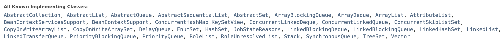

현실적으로 이 많은 클래스들의 사용법을 익히는 것보다 인터페이스 Collection의 사용법을 익히는 게 효율적이다.

따라서 앞으론 어떤 인스턴스를 만들던 인스턴스를 사용하고자 하는 목적의 인터페이스 타입으로 참조하여 사용하도록 훈련해야 한다. 만약 HashSet을 사용하다가 더 좋은 성능의 클래스가 발견됐을 때 new로 시작하는 생성하는 코드만 바꿔주면 나머진 수정할 필요가 없어진다. 인터페이스 타입으로 프로그래밍하려고 노력하자.

### Set 인터페이스

```java
public class Set01 {
    public static void main(String[] args) {
        Set<MyData> mySet = new HashSet<>();
        mySet.add(new MyData("lee", 100));
        mySet.add(new MyData("kim", 200));
        mySet.add(new MyData("park", 300));
        mySet.add(new MyData("park", 300));

        Iterator<MyData> iterator = mySet.iterator();
        while (iterator.hasNext()) {
            MyData myData = iterator.next();
            System.out.println(myData);
        }
    }
}

// 불변객체
class MyData {
    private String name;
    private int value;

    public MyData(String name, int value) {
        this.name = name;
        this.value = value;
    }

    public String getName() {
        return name;
    }

    public int getValue() {
        return value;
    }

    @Override
    public String toString() {
        return "MyData{" +
                "name='" + name + '\'' +
                ", value=" + value +
                '}';
    }
}

```

[실행결과]

MyData{name='kim', value=200}
MyData{name='park', value=300}
MyData{name='park', value=300}
MyData{name='lee', value=100}

분명 Set 인터페이스는 중복을 허용하지 않는다고 했는데 `name='park', value=300` 데이터가 중복되어 들어갔다.

Set 인터페이스를 HashSet 클래스로 구현했다. HashSet에 A라는 자료를 저장하려고 하면 먼저 A 자료가 가지고 있는 hashCode() 메소드를 먼저 호출한다.

`A.hashCode()`

그럼 해시코드 값이 추출되는데 만약 그 값이 '가'라면 '가'라는 바구니에 그 자료를 넣는다. 마찬가지로 B 자료를 넣으려면 먼저 그 해쉬값인 '나' 바구니에 넣는다.

* 해쉬 코드 값이 같은 C 자료를 넣을 경우 : equals() 메소드를 통해 A 자료와 값을 비교한다. 같은 값을 가지고 있지 않을 경우에만 '가'바구니에 저장한다.
* 해쉬 코드 값이 같은 D 자료를 넣을 경우 : equals() 메소드를 통해 순차적으로 A 자료, C 자료와 값을 비교한다.
* A 자료를 또 넣을 경우 : equals() 메소드를 통해 순차적으로 A 자료, C 자료, D 자료와 값을 비교한다. A자료와 중복되므로 저장되지 않는다.

이렇게 순차적으로 비교하려면 속도가 매우 느려진다. 성능이 가장 좋게 나오려면 해쉬코드값 하나당 하나의 자료만 저장되어야 한다.

그런데 방금 만든 MyData는 왜 중복저장이 됐을까? MyData에는 equals()와 hashCode() 메소드를 정의하지 않았다. 따라서 최상위 부모인 Object 것을 사용하는데 Object의 equals()와 hashCode()는 아무런 검사도 안해줘서 소용이 없다. 그래서 반드시 hashSet()의 해시 알고리즘을 사용하려면 equals()와 hashCode()를 오버라이딩 해줘야 한다.

> 인텔리제이에는 control+enter 로 equals()와 hashCode()를 쉽게 만들 수 있게 해준다.

```java
@Override
    public boolean equals(Object o) {
        if (this == o) return true;
        if (o == null || getClass() != o.getClass()) return false;
        MyData myData = (MyData) o;
        return value == myData.value && Objects.equals(name, myData.name);
    }

    @Override
    public int hashCode() {
        return Objects.hash(name, value);
    }
```

### Map 인터페이스

Map의 key값도 당연히 유일해야 하므로 hash 알고리즘이 사용된다. key도 equals와 hashCode를 구현하고 있어야 하고, String 값이 key가 될 수 있는 이유는 String 객체도 equals와 hashCode를 구현하고 있기 때문이다.

* map의 put 메소드는 같은 키 값으로 자료를 넣으면 이전 값이 업데이트된다. (덮어쓰기)

```java
        map.put("c", "300");
        map.put("c", "수정값");
```

* map의 모든 자료 출력하기

key들이 모인 것은 Set 자료구조인 keySet이다.

```java
        Set<String> keySet = map.keySet();
        Iterator<String> iterator = keySet.iterator();
        while (iterator.hasNext()) {
            String key = iterator.next();
            String value = map.get(key);

            System.out.println(key + " : " + value);
        }
```

### 정렬

배열을 정렬할 때에는 Arrays라는 클래스를 사용했다. 자료구조에서 유용한 메소드들을 모아놓은 클래스는 Collections가 있다.

> Collection 인터페이스와 구별하기

Collections 클래스의 sort 메소드를 이용해 List의 객체들을 정렬할 수 있다. 정렬이 되기 위해서는 Comparable 인터페이스를 구현하고 있는 객체만 가능하다. Comparable 인터페이스의 compareTo라는 메소드를 구현해줘야만 한다.

> List< String> list 의 경우 String은 이미 정렬을 위한 메소드를 가지고 있어서 sort가 가능했다.

* Collections.shuffle();
  * 자료들을 섞어주는 메소드. 출력할 때마다 순서가 다르게 나온다.

### JavaDoc 주석문

* /** ... */
* 사용하는 태그들

```java
/**
 * List 인터페이스 실습
 * 
 * @author jus 
 * @since 22.12.10
 * @version 1.0
 * 
 */

public class List01 {
    ...
}
```

#### IntelliJ에서 JavaDoc 생성하기

1. shift키 연속 2번
2. generate javaDoc 입력
3. custom scope 선택 - JavaDoc 생성할 패키지, 클래스, 인터페이스 등 선택 (exclude로 제외 지정 가능)
4. output directory - JavaDoc 생성할 경로 지정
5. other command line arguments에 다음 입력`-encoding UTF-8 -charset UTF-8 -docencoding UTF-8`

> 주석문을 잘 작성하는 방법은 주석문을 작성하지 않는 것이다.. 최소한으로 작성하자

## 예외(Exception) 처리

자바에서는 실행 시 2가지 형태의 오류가 발생할 수 있다.

1. Error: 수습할 수 없는 심각한 오류메모리 부족, 스택오버플로우 등이 발생하여 프로그램이 죽는 것은 프로그래머가 제어할 수 없다.
2. Exception: 예외 처리를 통해 수습할 수 있는 덜 심각한 오류

Error의 종류

* 컴파일시 발생하는 컴파일 에러
* 실행시 발생하는 런타임 에러

```java
public class Exception01 {
    public static void main(String[] args) {
        ExceptionObj1 exobj1 = new ExceptionObj1();
        int value = exobj1.divide(10, 0);
        System.out.println(value);
    }
}

class ExceptionObj1 {
    public int divide(int i, int k) {
        int value = 0;
        value = i / k;
        return value;
    }
}

```

0으로 나눌 수는 없기 때문에 java.lang.ArithmeticException 익셉션이 발생하면서 프로그램이 강제종료 된다.

익셉션을 발생할 때에는 JVM이 ArithmeticException 인스턴스 객체를 만들어서 발생해준다.

#### 예외 처리하기 (try-catch)

익셉션이 발생하는 코드에 try-catch 구문을 통해 예외를 처리해준다.

```java
try {
            value = i / k;
        } catch (ArithmeticException e) {
            System.out.println("0으로 나눌 수 없어요");
            System.out.println(e.toString());
        }
```

catch를 통해 익셉션을 발생시킨 객체를 잡아서 e 변수로 참조시킨다.

[결과]

0으로 나눌 수 없어요
java.lang.ArithmeticException: / by zero
0

10을 0으로 나누면 결과는 나오지 않는다. 근데 지금처럼 예외처리를 하면 value가 초기값인 0으로 출력된다. 이럴거면 차라리 익셉션이 발생하고 프로그램이 종료된 게 낫다. 에러나는 것보다 못한 결과. 이게 만약 돈과 관련된 프로그램에서 저 value 값이 사용된다고 생각해보면 끔찍한 일이 생길 것이다.

또 다른 문제는 사용자가 원하지 않는 메세지를 출력한다는 것이다. println으로 출력하는 클래스는 다른 사용자가 그 클래스를 사용했을 때에 원하지 않는 메세지가 출력되는 문제가 발생한다.

### 예외 떠넘기기(throws)

```java
public class Exception01 {
    public static void main(String[] args) {
        ExceptionObj1 exobj1 = new ExceptionObj1();
        try {
            int value = exobj1.divide(10, 0);
            System.out.println(value);
        } catch (ArithmeticException e) {
            System.out.println("0으로 나눌 수 없습니다.");
        }
    }
}

class ExceptionObj1 {
    public int divide(int i, int k) throws ArithmeticException{
        int value = 0;
        value = i / k;
  
        return value;
    }
}

```

이렇게 throws로 익셉션을 떠넘기면 사용하는 쪽(호출하는 쪽)에서 try catch 구문으로 예외를 처리해주면 된다. 원치 않는 메세지도 뜨지 않고, javaDoc을 통해 사용할 때 try catch만 해주면 되므로 앞의 예제보다 좋은 코드이다.

### RuntimeException과 Checked Exception


RuntimeException를 상속받고 있으면 다 RuntimeException이라고 할 수 있다. 이전에 발생한 ArithmeticException도 RuntimeException이다.

RuntimeException은 컴파일 시에 오류가 나지 않지만 실행 시에 오류가 발생한다. 실행시에 오류가 나서 프로그램을 죽이는 익셉션을 RuntimeException이라고 한다. 실행 시에 발생하므로 실행을 해보고 경험을 통해 수습하는 방법이 일반적이다.

Checked Exception은 RuntimeException을 상속받지 않은 익셉션을 뜻한다. IOException 등..

```java
    public static void main(String[] args) {
        FileInputStream fis = new FileInputStream("Exception01.java");
    }
```

FileInputStream을 사용할 때 위처럼만 작성하면 생성자부분에서 에러표시가 발생한다. 에러의 이유를 보면 익셉션 처리를 안해줘서이다.

FileInputStream의 코드를 보자.

```ㅓㅁㅍㅁ
    public FileInputStream(String name) throws FileNotFoundException {
        this(name != null ? new File(name) : null);
    }
```

FileInputStream은 FileNotFoundException을 throws로 넘기고 있다.

그럼 FileNoFoundException의 코드를 보자.

```ㅓㅁㅍㅁ
public class FileNotFoundException extends IOException {
    ...
}
```

IOException을 상속받고 있고, IOException은 Exception을 상속받고 있다.


RuntimeException을 상속받고 있지 않으므로 CheckedException이다. FileInputStream을 사용할 때에는 반드시 Exception 처리를 해줘야 한다.

* try-catch 예외 처리

```ㅓㅁㅍㅁ
public static void main(String[] args) {
        try {
            FileInputStream fis = new FileInputStream("Exception01.java");
        } catch (FileNotFoundException e) {
            System.out.println("파일을 찾을 수 없습니다.");
        }
    }
```

* throws 예외 떠넘기기 - 이 메소드를 호출한 쪽으로 예외처리를 떠넘긴다.

```java
public static void main(String[] args) throws FileNotFoundException{
        FileInputStream fis = new FileInputStream("Exception01.java");
    }
```

하지만 여기선 main이라서 main을 실행해주는 것은 JVM인데 JVM에게 예외처리를 떠넘기는 것은 무책임한 행동이다.

만약 나만의 Exception을 만들 때 RuntimeException이 좋을까 CheckedException이 좋을까?

컴파일 시에 에러를 띄워주는 CheckedException이 좋다고 생각할 수 있지만 바람직하지 않다. CheckedException이 많아지면 복잡해지고 사용자에게 강요할 것이 많아지므로 되도록이면 RuntimeException을 상속받은 익셉션을 만들어서 사용자가 사용하기 좋도록 만드는 게 좋다.

### 다중 Exception 처리

```ㅓㅁㅍㅁ
public class Exception01 {
    public static void main(String[] args) {
        int[] array1 = {4, 0};   //  1번
        int[] array2 = {4, 2};   //  2번
        int[] array3 = {4};   //  3번

        int[] value = null;

        try {
            value[0] = array1[0] / array1[1];
        } catch (ArrayIndexOutOfBoundsException aiobe) {    // 3번
            System.out.println(aiobe.toString());   
        } catch (ArithmeticException ae) {                  // 1번
            System.out.println(ae.toString());
        } catch (Exception e) {                             // 2번
            System.out.println(e.toString());
        }

    }
}

```

1번 : java.lang.ArithmeticException: / by zero

2번 : java.lang.NullPointerException

3번 : java.lang.ArrayIndexOutOfBoundsException: Index 1 out of bounds for length 1

Exception은 모든 익셉션의 조상이라서 다 지우고 Exception만 해줘도 되지 않을까? 그래도 되긴 하지만 특별히 처리하고 싶을 경우에 구체적인 익셉션에 대한 예외 처리를 해줘야 한다. 지금이야 그냥 익셉션 내용만 출력하고 있지만 나중엔 익셉션 케이스별로 다른 동작을 처리하게 설계를 해야할 때가 있다.

그래도 마지막에 꼭 Exception을 예외처리 해줘서 내가 예상하지 못한 익셉션이 발생했을 때를 대비한 방어적인 코드를 적어주는 게 좋다.

### 사용자 정의 Exception

```ㅓㅁㅍㅁ
public class Exception01 {
    public static void main(String[] args) {
        try {
            ExceptionObj eobj = new ExceptionObj();
            int value = eobj.divide(10, 0);
            System.out.println(value);
        } catch (MyException me) {
            System.out.println("사용자 정의 익셉션 발생");
        }
    }
}

class ExceptionObj {
    public int divide(int i, int k) throws MyException {
        int value = 0;
        try {
            value = i / k;
        } catch (ArithmeticException arithmeticException) {
            throw new MyException("0으로 나눌 수 없습니다.");
        }
        return value;
    }
}
```

가정) 모두를 위해 만든 실용적인 MyUtil 클래스

MyUtil이라는 클래스에는 a, b, c의 유용한 메소드가 있다. a, b, c 안에서 다양한 라이브러리, 클래스들을 이용해 기능을 구현해놨다. 다양한 클래스를 사용한 만큼 다양한 익셉션이 발생할 수 있다. a안에서 발생한 익셉션을 직접 처리하고 싶지 않다면 a메소드를 선언할 때 throws를 통해 다 적어줘야 한다.

`a() throws ..., ..., ..., ...`

이렇게 하면 a를 사용하는 사람이 try-catch로 익셉션을 처리해 사용하면 되는데 매우 귀찮은 과정이다.

그래서 a 메소드 안에서 try-catch 문으로 다양한 익셉션을 e로 받은 후 `throw new MyException("...")` 으로 하나의 새로운 익셉션으로 바꿔준 후 a를 선언할 때 `a() throws MyException`만 해주면 된다.

이렇게 하면 사용하는 입장에서도 간단하게 MyException에 대한 예외처리만 try-catch로 해주면 된다.

## Enum

* JDK 5부터 지원
* JDK 5이전에 어떤 상수들을 표현하고자 하면 다음과 같은 클래스를 작성했다.

```java
public class DayType {
    public final static int SUNDAY = 0;
    public final static int MONDAY = 1;
    public final static int TUESDAY = 2;
    ...
}
```

`int today = DayType.SUNDAY;`

문제는 today는 int형이므로 날짜를 나타내는 0~6 사이의 정수 이외에도 다른 정수를 가질 수 있다.

`today=100;`

정해진 값만 변수에 할당할 수 없는 문제가 생기는 것이다. 이런 문제는 타입에 안전하지 않다. 이를 해결하기 위해 등장한 문법이 Enum이다.

* 클래스 생성과 같은 방식
* com.example.enumtype 패키지

```java
public enum Day {
    SUNDAY,
    MONDAY,
    TUESDAY,
    WEDNESDAY,
    THURSDAY,
    FRIDAY,
    SATURDAY
}
```

```java
private Day today;
today.setDay(Day.SUNDAY);
```

이렇게 Day 타입으로 변수를 선언해두면 Enum으로 미리 정의해둔 값들만 가질 수 있게 되어 안전하다.

#### switch문에서 사용되는 Enum

```ㅓㅁㅍㅁ
        Day day = Day.SUNDAY;

        switch (day) {
            case SUNDAY:
                System.out.println("일");
                break;
            case MONDAY:
                System.out.println("월");
                break;
            default:
                System.out.println("그 밖의 요일");
        }        Day day = Day.SUNDAY;

        switch (day) {
            case SUNDAY:
                System.out.println("일");
                break;
            case MONDAY:
                System.out.println("월");
                break;
            default:
                System.out.println("그 밖의 요일");
        }
```

> switch 문에서 Enum 타입을 사용할 때 Day.SUNDAY가 아닌 그냥 선언해둔 상수 이름 SUNDAY로 접근한다.

#### Enum 타입의 특징

* Enum 생성자와 값 지정 가능
* Enum은 생성자를 가질 수 있다. 단, 생성자는 private해야 한다.
* Enum의 생성자는 내부에서만 호출 가능

```java
public enum Gender {
    MALE("XY"),
    FEMAIL("XX");
  
    private String chromosome; // 염색체

    private Gender(String chromosome) {
        this.chromosome = chromosome;
    }
}
```

```java
        Gender gender = Gender.MALE;
        System.out.println(gender);
```

[결과]

MALE

MALE의 chromosome 값을 출력하고 싶다면?

#### Enum에 메소드와 변수 선언

* Enum 안에 메소드와 변수를 선언할 수 있고, Object가 가진 메소드를 오버라이딩할 수도 있다.
* Gender에 Object가 가진 toString()을 오버라이딩 하자

```ㅓㅁㅍㅁ
    @Override
    public String toString() {
        return "Gender{" +
                "chromosome='" + chromosome + '\'' +
                '}';
    }
```

이렇게 해준 후 다시 출력해보면 chromosome 값이 출력된다.

Gender{chromosome='XY'}

#### Enum 값 끼리의 비교

* Enum은 상수기 때문에 메모리에 딱 하나만 올라간다. 상수는 변하지 않는 값이라서 메모리에 여러 개 있을 필요가 없기 때문이다. 그래서 비교를 할 때에는 ==을 사용한다.
* 인스턴스는 매번 생성할 때마다 다른 메모리에 저장되므로 ==를 사용하면 참조변수의 참조값을 비교하고, 메모리 값을 비교하고 싶을 때에는 equals() 메소드를 사용했다.

### EnumMap

* Enum 타입을 키로 사용할 수 있도록 도와주는 클래스
* java.lang.util.EnumMap

```java
    public static void main(String[] args) {
        EnumMap emap = new EnumMap(Gender.class);
        emap.put(Gender.MALE, "남자!!");
        emap.put(Gender.FEMAIL, "여자!!");

        System.out.println(emap.get(Gender.MALE));
        System.out.println(emap.get(Gender.FEMAIL));
    }
```

[결과]

남자!!
여자!!

### EnumSet

Enum 상수를 Set 자료구조로 다루기 위한 메소드를 제공하는 클래스

```java
    public static void main(String[] args) {
        EnumSet eset = EnumSet.allOf(Gender.class);

        // eset 모든 원소 출력
        Iterator<Gender> genderIter = eset.iterator();
        while (genderIter.hasNext()) {
            Gender gender = genderIter.next();
            System.out.println(gender);
        }
    }
```

#### Enum은 인터페이스를 구현할 수 있다.

```java
public interface Printer {
    public void print();
}
```

```java
public enum Gender implements Printer{
    ...

    @Override
    public void print() {
        System.out.println("염색체: " + chromosome);
    }
}
```

#### Enum은 추상메소드를 가질 수 있다.

추상 메소드를 가질 경우 상수를 정의할 때 추상메소드를 함께 구현해줘야 한다.

```ㅓㅁㅍㅁ
public enum Country {
    KOREA{
        @Override
        public void print() {
            System.out.println("대한민국");
        }
    },
    JAPAN{
        @Override
        public void print() {
            System.out.println("일본");
        }
    };
  
    public abstract void print();
}

```

```java
        Country country = Country.KOREA;
        country.print();
```

[결과]

대한민국

KOREA가 오버라이딩한 print() 메소드가 호출된 것을 확인할 수 있다.

#### 그외 Enum 특징

* Enum 객체는 Enum 상수가 처음 호출되거나 참조될 때 생성
* Enum은 Serializable과 Comparable 인터페이스를 이미 구현하고 있다.

> Serializable: JVM에서 해당 객체를 저장하거나, 다른 서버로 전송할 수 있도록 해준다.

## Java IO

> IO란? Input과 Output으로 입출력을 뜻한다.

#### Java IO도 객체이다.

* Java IO에서 사용되는 객체는 자바 세상에서 사용되는 객체이다.
* Java IO가 제공하는 객체는 어떤 대상으로부터 읽어들여, 어떤 대상에게 쓰는 일을 한다.

#### Java IO는 조립되어 사용되도록 만들어졌다.

Decorator 패턴으로 만들어졌다. Decorator은 장식한다는 뜻인데 Java IO에서 장식과 장식 대상은 뭘까?

장식을 한 대상에 또 장식을 하고 또 장식을 하는 패턴을 Decorator 패턴이라고 한다. Component를 상속받은 Decorator는 Component를 가질 수 있다. 즉, Component를 상속받고 있는 것들을 가질 수 있다는 것이다.


#### 주인공과 장식을 구분할 수 있어야 한다.

Java IO에서 Component 역할을 수행하는 것은 추상클래스 4가지 InputStream, OutputStream, Reader, Writer이다. new로 인스턴스를 생성할 수 없다.

주인공 역할은 Component를 상속받고 있는 ConcreteComponent이다. Decorator도 Component를 상속받고 있지만 다른점은 생성자에 Component가 들어간다는 것이다. 즉, 장식은 InputStream, OutputStream, Reader, Writer를 생성자에서 받아들이는 것이다.

#### Java IO의 특수한 객체

* System.in: 표준 입력 (InputStream)
  * 키보드로 입력받을 때
* System.out: 표준 출력 (PrintStream)
  * 화면에 출력할 때
* System.err: 표준 에러 출력 (PrintStream)

#### Java IO의 클래스 상속도


#### Java IO 클래스 이름이 중요하다.


* ByteArray로 시작할 경우: 입력 클래스의 경우 byte 배열로부터 읽어들이고, 출력 클래스의 경우 클래스 내부의 자료구조에 출력을 한 후 출력된 결과를 byte 배열로 반환
* CharArray로 시작할 경우: char 배열
* Filter로 시작할 경우: 보통 직접 사용하는 것보다 상속받아 사용하는데 사용자가 원하는 내용만 필터링할 목적으로 사용
* Data로 시작할 경우: 다양한 데이터 형을 입출력. 특히 기본형 값(int, float, double 등) 출력하는데 유리
* Buffered로 시작할 경우: 프로그램에서 Buffer는 메모리를 의미하는데 입출력 시에 병목현상을 줄이고 싶을 경우 사용한다.
* RandomAccessFile: 입력이나 출력을 모두 할 수 있는 클래스로, 파일에서 임의의 위치의 내용을 읽거나 쓸 수 있는 기능 제공

#### Java IO 클래스는 생성자가 중요하다.

https://docs.oracle.com/javase/7/docs/api/index.html?java/io/package-summary.html

Java IO 클래스들 중 InputStream, OutputStream, Reader, Writer을 상속받는 클래스들이 있는데 그 중 생성자로 InputStream, OutputStream, Reader, Writer을 받고 있는 클래스들이 있다. 이 클래스들이 장식 역할을 하는 Decorator이고, 그 외의 클래스들이 주인공 역할을 하는 ConcreteComponent이다.

주인공은 어떤 대상으로부터 읽어들이고 쓸 것인가를 결정한다.

**문제) 키보드로부터 한줄씩 입력 받아 화면에 한줄씩 출력하기**

키보드를 사용하려면 System.in을 사용해야 하고, 화면에 출력하려면 System.out을 사용해야 한다. 키보드에서 입력받는다는 것은 문자를 입력받는 것이기 때문에 char 단위 입출력이 필요하다. char 단위 입출력 클래스는 Reader, Writer을 사용해야 한다.

**BufferedReader 클래스**

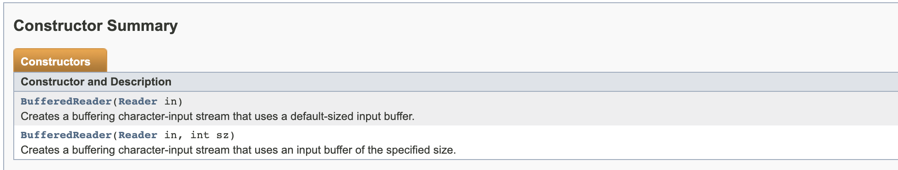

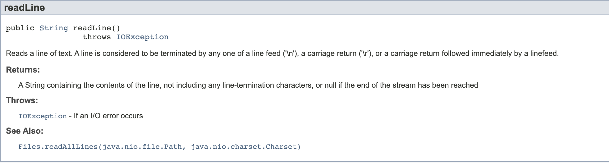

* readline메소드: 한줄 읽기. 더 이상 읽어들일 것이 없으면(EOF) null 반환
* BufferedReader는 주인공이 아닌 장식 역할이기에 생성자로 Reader를 받아줘야 한다. 그런데! Reader는 추상클래스이므로 Reader의 자식 클래스 중 하나를 받으면 된다.

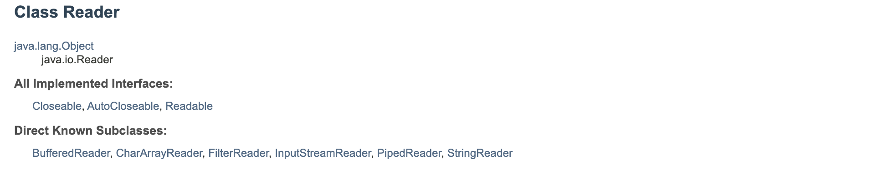

* 자식들 중 어떤 클래스를 생성자로 받아야 할까?
  * BufferedReader를 만드는데 생성자로 또 받을 수 없으므로 탈락
  * CharArrayReader는 문자로부터 읽어들이는데 우리는 키보드로부터 읽어들이므로 탈락
  * FilterReader는 마찬가지로 생성자로 Reader를 받아야 하는 장식이므로 탈락
  * InputStreamReader는 InputStream을 받아들여야 하는 장식. 그런데 우리가 키보드로 받아들이려면 System.in을 사용해야 한다고 했었다. System.in은 InputStream을 상속받는 주인공이므로 BufferReader의 생성자로 알맞다.

한줄 쓰기: PrintStream, PrintWriter

```java
public class KeyboardIO {
    public static void main(String[] args) throws Exception {
        BufferedReader br = new BufferedReader(new InputStreamReader(System.in));

        String line = null;

        while ((line = br.readLine()) != null) {
            System.out.println("읽어들인 값: " + line);
        }
    }
}
```

## File 클래스

java.io.File 클래스는 파일의 크기, 파일의 접근 권한, 파일의 삭제, 이름 변경 등의 작업을 할 수 있게 해준다.

> 디렉토리(폴더)도 파일로 취급한다.

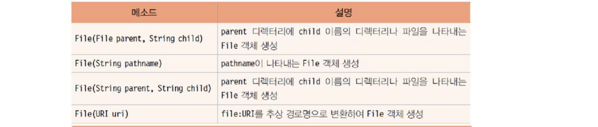

new File 했다고 진짜 파일이 생성되는 것은 아니고 메모리 상에 인스턴스가 생성되는 것이다.

**파일 정보 알려주는 예제**

```java
import java.io.File;
import java.io.IOException;

public class FileInfo {
    public static void main(String[] args) {
        if (args.length != 1) {
            System.out.println("사용법: java FileInfo 파일이름");
            System.exit(0);
        }

        File f = new File(args[0]);
        if (f.exists()) { // 파일이 존재할 경우
            System.out.println("length: " + f.length());
            System.out.println("canRead: " + f.canRead());
            System.out.println("canWrite: " + f.canWrite());
            System.out.println("getAbsolutePath: " + f.getAbsolutePath());

            try {
                System.out.println("getCanonicalPath: " + f.getCanonicalPath());
            } catch (IOException e) {
                System.out.println(e);
            }

            System.out.println("getName: " + f.getName());
            System.out.println("getParent: " + f.getParent());
            System.out.println("getPath: " + f.getPath());

        } else { // 파일이 존재하지 않을 경우
            System.out.println("파일이 존재하지 않습니다.");
        } 
    }
}

```

**파일 삭제 예제**

```java
public class FileDelete {
    public static void main(String[] args) {
        if (args.length != 1) {
            System.out.println("사용법: java FileDelete 파일이름");
            System.exit(0);
        }

        File f = new File(args[0]);
        if (f.exists()) { // 파일이 존재할 경우
            boolean deleteflag = f.delete();
            if (deleteflag) {
                System.out.println("파일 삭제 성공");
            } else {
                System.out.println("파일 삭제 실패");
            }
        } else {
            System.out.println("파일이 존재하지 않습니다.");
        }
    }
}

```

실제로 파일을 생성 후 아규먼트로 파일경로를 넘겨주면 잘 삭제가 된다. 사실 이건 파일 작성자와 코드 실행자가 같기 때문에 권한이 맞아서 된 것이다.

root로 사용자 권한을 바꾼 후 파일을 생성해서 실행해보면 실패하는 것을 확인할 수 있다.

**파일 목록 예제**

```java
public class FileList {
    public static void main(String[] args) {
        File file = new File("/tmp");
        File[] files = file.listFiles();

        for (File i : files) {
            System.out.println(i.getName());
        }
    }
}
```

"/tmp"가 아닌 "/tmp/myfile01.txt"처럼 폴더형식이 아니라면 NullPointerException이 뜬다. 그래서 방어적인 프로그래밍을 위해 디렉토리인지 확인하는 if문을 넣어주면 좋다.

디렉토리 안의 파일이 있을 수 있고, 폴더가 있을 수도 있으므로 폴더일 때는 목록, 파일일 때는 파일 이름이 출력되도록 재귀를 이용해 다음처럼 코딩할 수 있다.

```java
public class FileList {
    public static void main(String[] args) {
        File file = new File("/tmp");

        printFile(file);
    }

    private static void printFile(File file) {
        if (file.isDirectory()) {
            File[] files = file.listFiles();
            for (int i = 0; i < files.length; i++) {
                System.out.println("[dir] - " + files[i]);
                printFile(files[i]);
            }
        } else {
            System.out.println(file.getName());
        }
    }
}

```

### File 클래스를 이용한 임시 파일의 생성과 삭제

/tmp 폴더에는 임시파일이 많이 만들어졌다가 사라진다. 프로그램을 실행하다 보면 실행되는 동안에만 필요한 파일들이 생길 수 있는데 이런 파일들을 임시파일이라고 한다.

**임시파일 생성하기**

```
File.createTempFile("tmp_", ".dat");
````

prefix이 tmp_, sufix이 ".dat"인 임시파일을 생성했다. 실제로 absolutePath를 출력해본 후 터미널에서 `ls -la` 명령어로 확인할 수 있다.

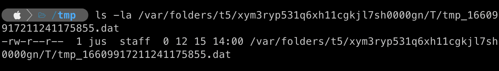

임시파일은 실행중에만 잠시 필요하고 나중엔 필요 없으므로 삭제해주는 게 좋다.

**임시파일 생성 후 삭제 예제**

```java
public static void main(String[] args) {
        try {
            File f = File.createTempFile("tmp_", ".dat");
            System.out.println(f.getAbsolutePath());
            System.out.println("60초 정지");
            try {
                Thread.sleep(60000);     // 60초간 프로그램 정지
            } catch (InterruptedException e1) {
                System.out.println(e1);
            }
            f.deleteOnExit();    // JVM이 종료될 때 임시파일 자동 삭제
        } catch (IOException e) {
            System.out.println(e);
        }
    }
```

코드를 실행해보면 60초간은 프로그램이 멈춰있으므로 생성한 파일을 확인할 수 있지만 60초가 지나면 JVM이 종료되면서 임시파일이 삭제되는 것을 확인할 수 있다.

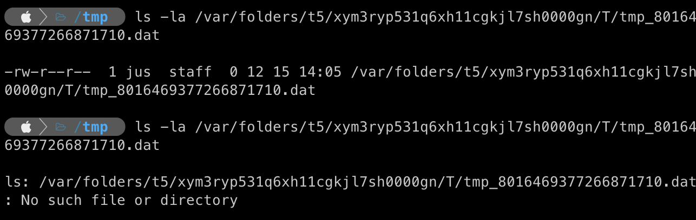

### Byte Stream

Byte 단위로 입력받고 출력하는 클래스는 전부 InputStream과 OutputStream의 자손들이다.

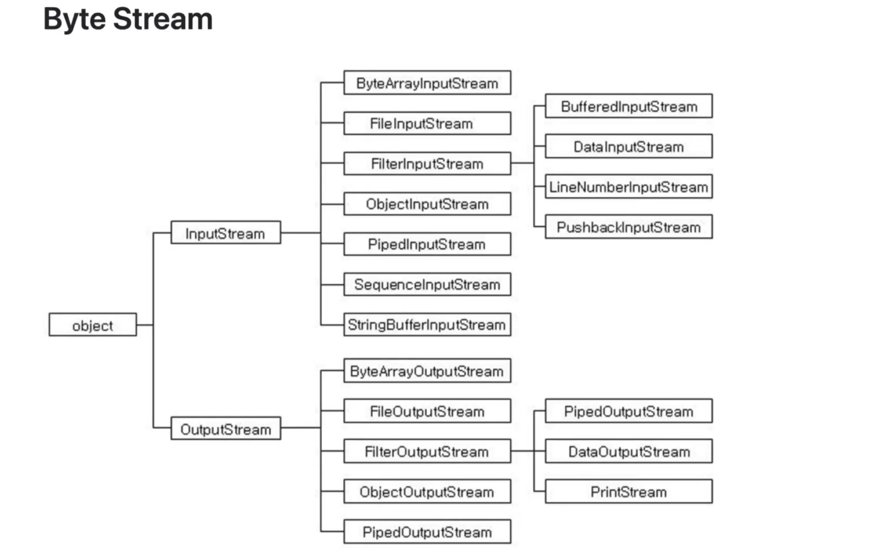

### InputStream 중요 메소드

* `int available() throws IOException`: 현재 읽을 수 있는 바이트 수 반환
* `void close() throws IOException`: 입력 스트림 닫기
* `int read() throws IOException`: 입력 스트림에서 한 바이트를 읽어서 int 값으로 반환한다. 더 이상 읽어 들여야 할 내용이 없을 경우 -1 반환
* `int read(byte buf[]) throws IOException`: 입력 스트림에서 buf[] 크기만큼을 읽어 buf에 저장하고 읽은 바이트 수를 반환한다. 더 이상 읽어 들여야 할 내용이 없을 경우 -1 반환
* `int skip(long numBytes) throws IOException`: numBytes로 지정된 바이트를 무시하고, 무시된 바이트 수를 반환한다.

이 중 가장 중요한 메소드는 추상 메소드인 read() 메소드이다.

```java
public static void main(String[] args) {
        InputStream in = null;
        try {
            int data = in.read();
        } catch (IOException exception) {
            System.out.println("io 오류: " + exception);
        } finally {
            try {
                in.close();
            } catch (Exception e2) {
                System.out.println("io 오류: " + e2);
            }
        }
    }
```

예제를 보면 null인 스트림을 read()로 한 바이트를 읽고 있다.

**그런데 바이트로 읽어들이는 메소드를 왜 int형 변수 data로 받을까?**

1byte는 8bit이므로 00000000 ~ 11111111까지 표현할 수 있다. read() 메소드가 읽어들일 수 있는 값 또한 같은 범위 중 한 값이다. 1byte씩 파일을 읽어들이는데 만약 파일의 크기를 모른다면 더 이상 읽을 것이 없을 때(EOF)까지 읽어들인다. EOF는  00000000 ~ 11111111 범위 내에서 표현할 수 없다. 그래서 int에 1byte 값을 담은 것이다.(그릇을 큰 걸 쓰자)

int는 4byte라서 EOF를 -1이라고 했을 때 2의 보수값인 11111111 11111111 11111111 11111111으로 표현이 가능해지는 것이다.

> EOF값인 -1을 표현하기 위해 4byte를 표현할 수 있는 int형으로 반환한다!!

문제

1. txt 파일로부터 한줄씩 입력받아 화면에 출력

파일로부터 읽기: BufferedReader(FileReader)의 readline()

화면에 출력: System.out

```java
    public static void main(String[] args) throws IOException {
        // 파일 객체 생성
        File f = new File("/tmp/Sample.txt");

        // BufferedReader의 생성자로 넣어줄 InputStream 생성
        FileReader fr = new FileReader(f);

        BufferedReader br = new BufferedReader(fr);
        String line = "";
        while ((line = br.readLine()) != null) {
            System.out.println(line);
        }

    }
```

2. 키보드로부터 한줄씩 입력받아 파일에 출력 (파일명은 아규먼트로 받아들인다)

키보드로부터 한줄씩 입력: BufferdReader(System.in)의 readline()

파일에 출력: BufferdWriter(FileWriter)의 write

```java
    public static void main(String[] args) throws IOException {
        // 키보드로부터 한줄씩 입력받기
        BufferedReader br = new BufferedReader(new InputStreamReader(System.in));
        String s = "";

        // 파일 객체 생성
        File f = new File(args[0]);

        // BufferedWrite 생성자에 넣을 OutputStream 생성
        FileWriter fw = new FileWriter(f);

        // BufferedWrite 생성
        BufferedWriter bw = new BufferedWriter(fw);

        while (true) {
            s = br.readLine();
            if (s.equals("q")) {
                break;
            }
            bw.write(s+"\n");
        }

        bw.flush();
        bw.close();
    }
```

3. txt 파일로부터 한줄씩 입력받아 다른 파일에 한줄씩 출력한다.

txt 파일로부터 입력: FileReader

한줄씩 입력: BufferedReader의 readline()

다른 파일에 출력: FileWriter

한줄씩 출력: BufferedWriter의 writer()

```java
    public static void main(String[] args) throws IOException {
        // 입력받을 파일 객체 생성
        File f1 = new File("/tmp/Sample.txt");

        // FileReader 생성 - 주인공
        FileReader fr = new FileReader(f1);

        // BufferedReader 생성 - 데코레이터
        BufferedReader br = new BufferedReader(fr);

        // 출력할 파일 객체 생성
        File f2 = new File("/tmp/Sample02.txt");

        // FileWriter 생성 - 주인공
        FileWriter fw = new FileWriter(f2);

        // BufferedWriter 생성 - 데코레이터
        BufferedWriter bw = new BufferedWriter(fw);

        String line = "";
        while ((line = br.readLine()) != null) {
            bw.write(line + "\n");
        }

        bw.flush();
        bw.close();
    }
```

#### 파일 쓰기

```java
        PrintWriter out = new PrintWriter(new OutputStreamWriter(new FileOutputStream("/tmp/my.txt")));
```

* FileOutputStream
  * write(int) 메소드로 int의 마지막 byte만 저장
* OutputStreamWriter
  * 생성자: FileOutputStream
  * Writer이기 때문에 int의 마지막 char만 저장
* PrintWriter
  * 생성자: OutputStreamWriter
  * println(문자열) 메소드로 문자열 출력

#### 파일 읽기

FileWriter로 한글자씩 쓸 때 영어로 쓰면 문자 개수만큼의 byte 용량을 차지하고, 한글로 쓰면 한글자 당 3byte씩 용량을 차지하는 것을 확인했다. 한글은 2byte씩 저장하는 것으로 알고 있었지만 자바의 유니코드는 종류가 다양하기에 현재는 3byte씩 처리하는 인코딩을 사용중인 것이다.

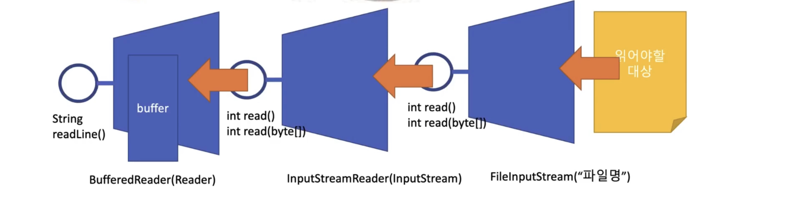

읽어야할 대상이 파일이라고 하면 FileInputStream의 read() 메소드를 통해 1byte씩 읽어들인다.

InputStreamReader는 생성자로 InputStream 즉, FileInputStream을 받아서 read() 메소드를 통해 2byte씩 읽어들인다.(Reader이므로 char 읽어들이기 때문에 2byte씩!) 내부적으로는 FileInputStream의 read() 메소드를 2번 실행하는 것이다.

BufferedReader는 생성자에 Reader를 받는데 여기선 InputStreamReader를 받는다. buffer를 가지고 있어서 readLine()을 통해 한줄을 읽을 수 있다. 내부적으로는 readLine()이 InputStreamReader의 read()메소드는 buffer에 한줄이 다 찰때까지 호출해서 읽어온다.

```java
    public static void main(String[] args) throws IOException {
        BufferedReader in = new BufferedReader(new InputStreamReader(new FileInputStream("/tmp/my.txt")));

        String line = "";
        while ((line = in.readLine()) != null) {
            System.out.println(line);
        }

        in.close();
    }
```

#### 파일과 폴더 다이어그램

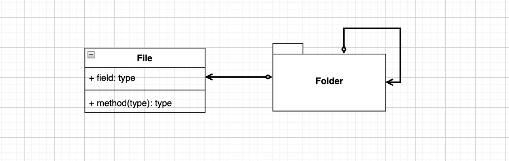

폴더는 파일을 가질 수 있고, 폴더도 가질 수 있다.

**다른 표현법**

파일과 폴더의 공통적인 부분을 Node라고 하면 아래처럼 표현해도 위와 동일하다.

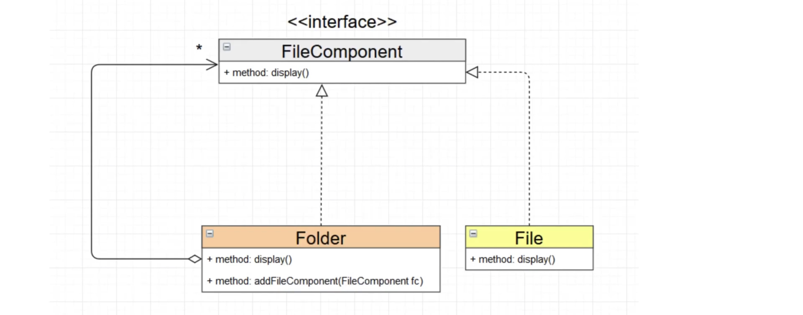

이런식으로 표현하는 방법을 composite 패턴이라고 부른다.

#### Composite 패턴

단일 객체와 그 객체들을 가지는 집합 객체를 같은 타입으로 취급하며, 트리 구조로 객체들을 엮는 패턴이다.

즉, 위의 파일과 폴더 관계를 적용시켜보면 단일객체는 파일을 의미하고 그 객체들을 가지는 집합 객체는 폴더를 의미한다. 파일과 폴더 둘을 같은 타입으로 취급하는 것이다.

같은 타입으로 취급한다는 것은 같은 인터페이스를 가지고 있다는 말과 같다.

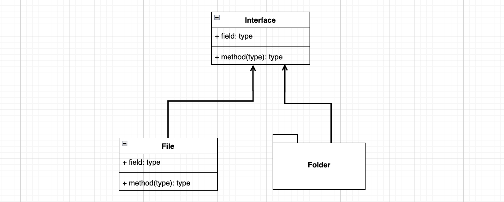

Composite 패턴에서는 Interface를 Component라고 하고 이를 상속받은 객체를 Leaf, Composite라고 부른다. 이 중 Composite에는 Object의 리스트가 들어가는데 이 안에는 Component가 들어간다. Component가 들어간다는 것은 Leaf 객체가 들어갈 수도 있고, Composite가 들어갈 수도 있는 것이다.


여기서 단일 객체를 Leaf라고 표현할 이유는 Composite 패턴이 트리 구조를 나타내기 좋기 때문이다.

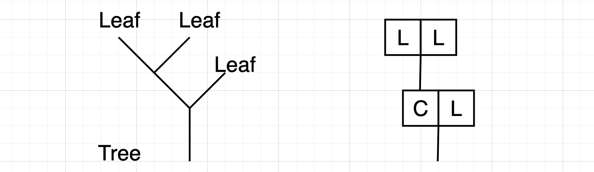

```java
public class CompositeExam {
    public static void main(String[] args) {
        Composite c1 = new Composite();
        c1.add(new Leaf());
        c1.add(new Leaf());

        Composite c0 = new Composite();
        c0.add(new Leaf());
        c0.add(c1);

        c0.fn();
    }
}

interface Component {
    public void fn();
}

class Leaf implements Component {

    @Override
    public void fn() {
        System.out.println("Leaf");
    }
}

class Composite implements Component {

    private List<Component> list = new ArrayList<Component>();

    @Override
    public void fn() {
        System.out.println("Composite");
        for (Component c : list) {
            c.fn();
        }
    }

    public void add(Component component) {
        list.add(component);
    }

    public void remove(Component component) {
        list.remove(component);
    }
}
```

트리 구조가 아주 복잡할 때 트리의 루트에서 함수 하나만 정의해주면 Composite 패턴에 따라서 Leaf까지 그 함수가 자동으로 호출된다는 장점이 있다.

**고양이 강아지 예제**

- zoo 그룹
  - cat 3마리 그룹
  - dog 2마리 그룹

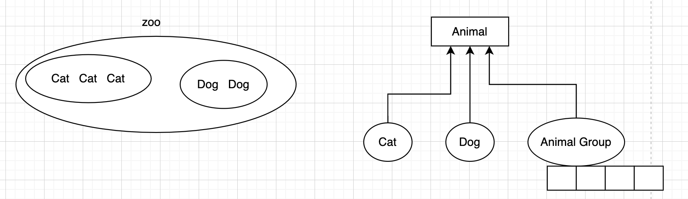

```java
public class CompositeExam2 {
    public static void main(String[] args) {
        AnimalGroup cats = new AnimalGroup();
        cats.add(new Cat());
        cats.add(new Cat());
        cats.add(new Cat());

        AnimalGroup dogs = new AnimalGroup();
        dogs.add(new Dog());
        dogs.add(new Dog());

        AnimalGroup zoo = new AnimalGroup();
        zoo.add(cats);
        zoo.add(dogs);

        zoo.speak();

    }
}

interface Animal {
    public void speak();
}

class Cat implements Animal {
    @Override
    public void speak() {
        System.out.println("야옹");
    }
}

class Dog implements Animal {
    @Override
    public void speak() {
        System.out.println("멍멍");
    }
}

class AnimalGroup implements Animal {
    List<Animal> animals = new ArrayList<Animal>();

    public void add(Animal animal) {
        animals.add(animal);
    }

    public void remove(Animal animal) {
        animals.remove(animal);
    }

    @Override
    public void speak() {
        System.out.println("AnimalGroup speaking...");
        for (Animal animal : animals) {
            animal.speak();
        }
    }
}

```

#### Decorator속 Composite 패턴

자바 IO는 Decorator 패턴으로 만들어졌다. Decorator 패턴에서도 composite 패턴을 발견할 수 있다.

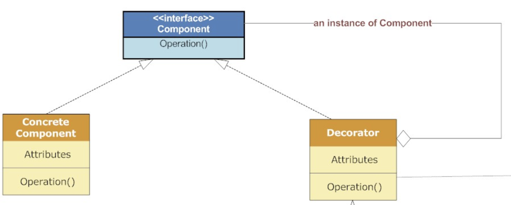

#### 문제) 케이크를 데코레이터 패턴으로 만들어보기

* CakeComponent
  * 주인공: CakeConcreteComponent
  * 데코레이터: CakeComponentDecorator
    * CakeSheet
      * RoundSheet
      * RecSheet
    * CakeCream
      * Choco
      * Strawberry

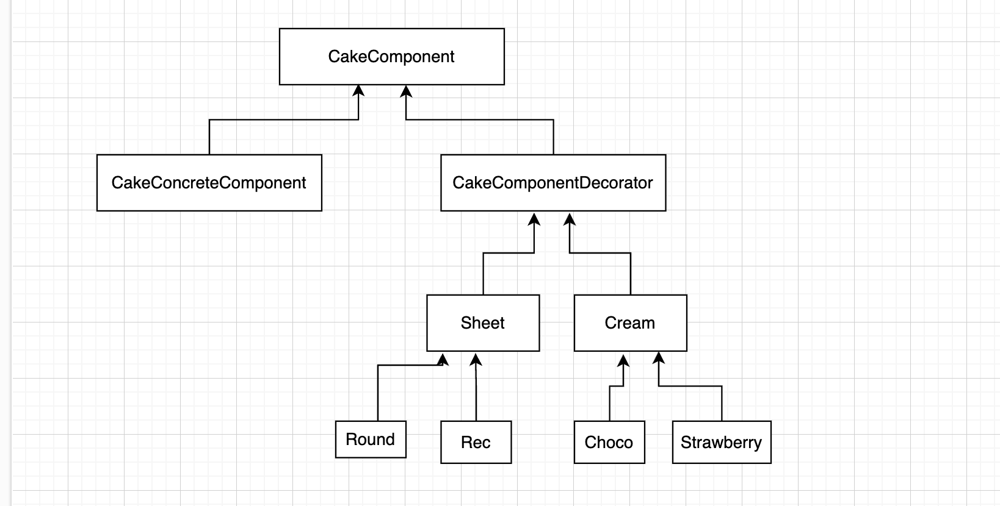

Component: CakeComponent

```java
public interface CakeComponent {
    String decorate();
}
```

주인공: CakeConcreteComponent

```java
public class CakeConcreteComponent implements CakeComponent{
    @Override
    public String decorate() {
        return "케이크";
    }
}
```

데코레이터: CakeComponentDecorator

```java
abstract class CakeComponentDecorator implements CakeComponent {
    private final CakeComponent cakeComponent;

    CakeComponentDecorator(CakeComponent cakeComponent) {
        this.cakeComponent = cakeComponent;
    }

    @Override
    public String decorate() {
        return cakeComponent.decorate();
    }

}
```

데코레이터들

```java
public class RecSheet extends Sheet{

    RecSheet(CakeComponent cakeComponent) {
        super(cakeComponent);
    }

    @Override
    public String decorate() {
        return "네모 " + super.decorate();
    }
}

public class ChocoCream extends Cream{

    ChocoCream(CakeComponent cakeComponent) {
        super(cakeComponent);
    }

    @Override
    public String decorate() {
        return "초코 " + super.decorate();
    }
}

public class ButterCream extends Cream{

    ButterCream(CakeComponent cakeComponent) {
        super(cakeComponent);
    }

    @Override
    public String decorate() {
        return "버터 " + super.decorate();
    }
}

public abstract class Cream extends CakeComponentDecorator{
    Cream(CakeComponent cakeComponent) {
        super(cakeComponent);
    }

}

public abstract class Sheet extends CakeComponentDecorator{

    Sheet(CakeComponent cakeComponent) {
        super(cakeComponent);
    }

}

public class RoundSheet extends Sheet{

    RoundSheet(CakeComponent cakeComponent) {
        super(cakeComponent);
    }

    @Override
    public String decorate() {
        return "둥근 " + super.decorate();
    }
}
```

케이크 만들기 테스트

```java
public static void main(String[] args) {
        // 버터 둥근 케이크
        CakeComponent c1 = new ButterCream(new RoundSheet(new CakeConcreteComponent()));
        String s1 = c1.decorate();
        System.out.println(s1);

        // 네모 초코 케이크
        CakeComponent c2 = new RecSheet(new ChocoCream(new CakeConcreteComponent()));
        String s2 = c2.decorate();
        System.out.println(s2);
    }
```

[결과]

버터 둥근 케이크
네모 초코 케이크

## CompositePattern 실습 - 파일과 폴더

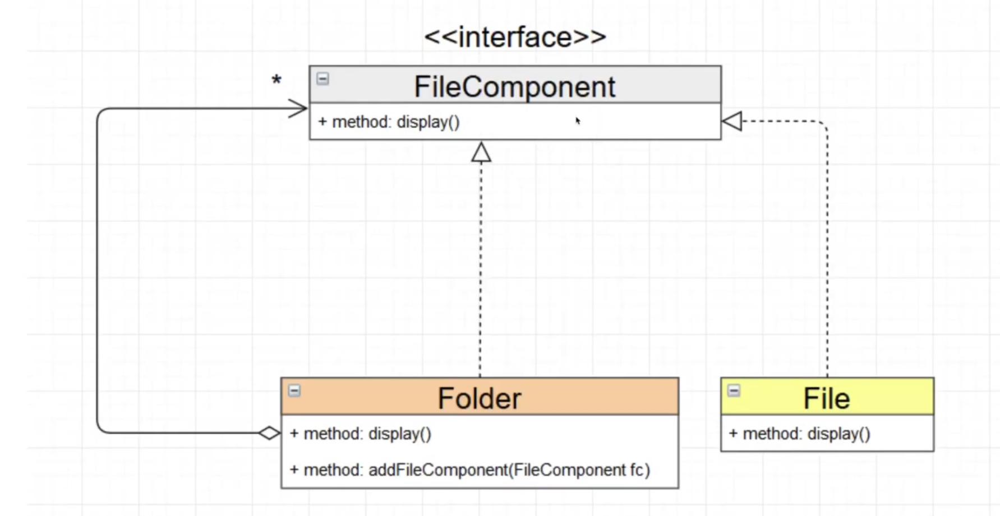

파일과 폴더의 공통점을 FileComponent로 뽑아내서 인터페이스 또는 추상클래스로 만든 후 폴더와 파일이 상속받도록 했다.

폴더는 FileComponenet를 상속받고 있지만 소유할 수도 있다. FileComponent는 인터페이스이거나 추상클래스이므로 인스턴스가 될 수 없는데 소유할 수 있다고 했으므로 FileComponent를 상속받은 폴더나 파일을 소유할 수 있다는 뜻이다.

#### FileComponent - Node

```java
public abstract class Node {
    private String name;

    public Node(String name) {
        this.name = name;
    }

    public String getName() {
        return name;
    }

    public void setName(String name) {
        this.name = name;
    }

    public abstract long getSize();
    public abstract boolean isFolder();
}

```

#### File

```java
public class File extends Node{
    private long size;

    public File(String name, long size) {
        super(name);
        this.size = size;
    }

    @Override
    public long getSize() {
        return this.size;
    }

    @Override
    public boolean isFolder() {
        return false;
    }
}

```

#### Folder

```java
public class Folder extends Node {
    private List<Node> nodes;

    public Folder(String name) {
        super(name);
        nodes = new ArrayList<>();
    }

    public void add(File file) {
        nodes.add(file);
    }

    public void add(Folder folder) {
        nodes.add(folder);
    }

    @Override
    public long getSize() {
        long total = 0;
        for (int i = 0; i < nodes.size(); i++) {
            total += nodes.get(i).getSize();
        }
        return total;
    }

    @Override
    public boolean isFolder() {
        return true;
    }
}

```

#### main클래스

```java
public static void main(String[] args) {
        File f1 = new File("file1", 10L);
        File f2 = new File("file2", 20L);
        File f3 = new File("file3", 30L);


        Folder folder1 = new Folder("folder1");
        Folder folder2 = new Folder("folder2");

        folder1.add(f1);
        folder1.add(folder2);

        folder2.add(f2);
        folder2.add(f3);

        System.out.println(folder1.getSize());

    }
```

[결과]

60

### DecoratorPattern 실습 - ShapeDecorator

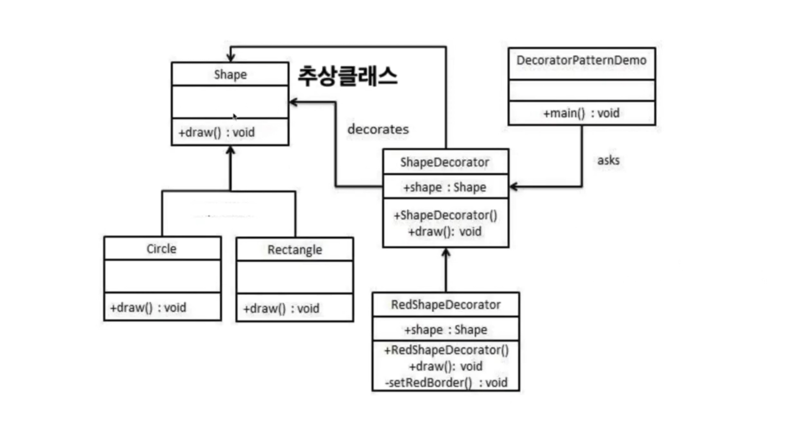

Shape

```java
public abstract class Shape {
    public abstract void draw();
}
```

Circle

```java
public class Circle extends Shape {
    @Override
    public void draw() {
        System.out.println("Shape: Circle");
    }
}
```

Rectangle

```java
public class Rectangle extends Shape {
    @Override
    public void draw() {
        System.out.println("Shape: Rectangle");
    }
}
```

ShapeDecorator

```java
public abstract class ShapeDecorator extends Shape {
    protected Shape decoratorShape;

    public ShapeDecorator(Shape decoratorShape) {
        this.decoratorShape = decoratorShape;
    }

    @Override
    public void draw() {
        decoratorShape.draw();
    }
}
```

RedShapeDecorator

```java
public class RedShapeDecorator extends ShapeDecorator {

    public RedShapeDecorator(Shape decoratorShape) {
        super(decoratorShape);
    }

    @Override
    public void draw() {
        setRedBorder(decoratorShape);
    }

    private void setRedBorder(Shape decoratedShape) {
        System.out.println("Red ============ Start");
        decoratorShape.draw();
        System.out.println("Red ============ Start");
    }
}
```

GreenShapeDecorator

```java
public class GreenShapeDecorator extends ShapeDecorator {

    public GreenShapeDecorator(Shape decoratorShape) {
        super(decoratorShape);
    }

    @Override
    public void draw() {
        setRedBorder(decoratorShape);
    }

    private void setRedBorder(Shape decoratedShape) {
        System.out.println("Green ============ Start");
        decoratorShape.draw();
        System.out.println("Green ============ Start");
    }
}
```

main

```java
public static void main(String[] args) {
        Circle c = new Circle();

        RedShapeDecorator redShapeDecorator = new RedShapeDecorator(c);

        GreenShapeDecorator greenShapeDecorator = new GreenShapeDecorator(redShapeDecorator);

        // greenShapeDecorator.draw();

        Shape shape = new GreenShapeDecorator(new RedShapeDecorator(new Rectangle()));

    }
```

[결과]

```
Green ============ Start
Red ============ Start
Shape: Circle
Red ============ Start
Green ============ Start
```

전의 예제 InputStream와 비교해보면 Shape가 InputStream(추상클래스) 역할, Rectangle, Circle이 FileInputStream 역할, RedShapeDecorator, GreenShapeDecorator이 DataInputStream 역할을 한다.

```java
InputStream in = new DataInputStream(new FileInputStream("a.txt"));
```


## DataInputStream, DataOutputStream

* 기본형 타입과 문자열을 읽고 쓸 수 있다.

```java
public static void main(String[] args) throws IOException {
        // 이름, 국어점수, 영어점수, 수학점수, 평균점수를 /tmp/score.dat 파일에 저장하시오.
        String name = "kim";
        int kor = 90;
        int eng = 50;
        int math = 70;

        double total = kor + eng + math;
        double avg = total / 3.0;

        DataOutputStream out = new DataOutputStream(new FileOutputStream("/tmp/score.dat"));
        out.writeUTF(name);
        out.writeInt(kor);
        out.writeInt(eng);
        out.writeInt(math);
        out.writeDouble(total);
        out.writeDouble(avg);
        out.close();


        // 파일에서 읽어오기
        DataInputStream dataInputStream = new DataInputStream(new FileInputStream("/tmp/score.dat"));

        System.out.println(dataInputStream.readUTF());
        System.out.println(dataInputStream.readInt());
        System.out.println(dataInputStream.readInt());
        System.out.println(dataInputStream.readInt());
        System.out.println(dataInputStream.readDouble());
        System.out.println(dataInputStream.readDouble());


    }
```

## ByteArrayInputStream, ByteArrayOutputStream

* byte[]에 데이터를 읽고 쓰기

```java
public static void main(String[] args) throws IOException {

        // 쓰기
        int data1 = 1;
        int data2 = 2;

        ByteArrayOutputStream out = new ByteArrayOutputStream();
        out.write(data1);   // data1의 마지막 1byte 저장
        out.write(data2);
        out.close();

        byte[] array = out.toByteArray();


        // 읽기
        ByteArrayInputStream in = new ByteArrayInputStream(array);
        int read1 = in.read();
        int read2 = in.read();
        int read3 = in.read();  // -1
        in.close();

        System.out.println(read1);
        System.out.println(read2);
        System.out.println(read3);
    }
```

## CharArrayReader, CharArrayWriter

* char[]에 데이터 읽고 쓰기

```java
public static void main(String[] args) throws IOException {
        char a = 'a';
        char b = 'b';
        char c = 'c';

        CharArrayWriter cw = new CharArrayWriter();
        cw.write(a);
        cw.write(b);
        cw.write(c);
        cw.close();

        char[] arr = cw.toCharArray();
        String str = cw.toString();

        CharArrayReader cr = new CharArrayReader(arr);
        char read1 = (char) cr.read();
        char read2 = (char) cr.read();
        char read3 = (char) cr.read();

        System.out.println(read1);
        System.out.println(read2);
        System.out.println(read3);
    }
```

## StringReader, StringWriter

* 문자열 읽고 쓰기

```java
public static void main(String[] args) throws IOException {
        StringWriter sw = new StringWriter();
        sw.write("hello");
        sw.write("world");
        sw.write("!!!");
        sw.close();

        String str = sw.toString();

        StringReader sr = new StringReader("helloworld!!!");
        int ch = -1;

        while ((ch = sr.read()) != -1) {
            System.out.print((char)ch);
        }

        sr.close();
    }
```

## ObjectInputStream, ObjectOutputStream

* 직렬화 가능한 대상을 읽고 쓰기
* 직렬화란? 객체를 직렬화하여 전송 가능한 형태로 만드는 것
* 직렬화 가능한 대상이란? 기본형 타입 or java.io.Serializable 인터페이스를 구현하고 있는 객체
  * java.io.Serializable 인터페이스는 메소드가 하나도 없어서 구현만 해주면 된다.
  * 이렇게 메소드가 없는 인터페이스를 마크(표시) 인터페이스라고 한다.

Serializable을 구현한 User 객체 (전송할 객체)

```java
public class User implements Serializable {
    private String email;
    private String name;
    private int birthYear;

    public User(String email, String name, int birthYear) {
        this.email = email;
        this.name = name;
        this.birthYear = birthYear;
    }

    public String getEmail() {
        return email;
    }

    public String getName() {
        return name;
    }

    public int getBirthYear() {
        return birthYear;
    }

    @Override
    public String toString() {
        return "User{" +
                "email='" + email + '\'' +
                ", name='" + name + '\'' +
                ", birthYear=" + birthYear +
                '}';
    }
}
```

User 객체가 직렬화 가능하다는 것은 그 필드들도 직렬화 가능해야 한다. String을 뜯어보면 java.io.Serializable 인터페이스를 구현하고 있고, int는 기본형 타입이므로 직렬화 가능하다.

```java
public static void main(String[] args) throws IOException, ClassNotFoundException {
        // 직렬화 가능한 객체 생성
        User user = new User("lee@naver.com", "lee", 1999);

        // 객체 저장
        ObjectOutputStream out = new ObjectOutputStream(new FileOutputStream("/tmp/user.dat"));
        out.writeObject(user);
        out.close();

        // 객체 읽어오기
        ObjectInputStream in = new ObjectInputStream(new FileInputStream("/tmp/user.dat"));
        User u = (User) in.readObject();
        in.close();

        System.out.println(u);
    }
```

ArrayList도 Serializable을 구현한 것이므로 직렬화 가능하다.

```java
public static void main(String[] args) throws IOException, ClassNotFoundException {
        User u1 = new User("lee@naver.com", "lee", 1999);
        User u2 = new User("kim@naver.com", "kim", 2003);
        User u3 = new User("park@naver.com", "park", 2010);

        ArrayList<User> users = new ArrayList<>();

        users.add(u1);
        users.add(u2);
        users.add(u3);

        ObjectOutputStream out = new ObjectOutputStream(new FileOutputStream("/tmp/userlist.dat"));
        out.writeObject(users);
        out.close();

        ObjectInputStream in = new ObjectInputStream(new FileInputStream("/tmp/userlist.dat"));

        ArrayList<User> list = (ArrayList<User>) in.readObject();
        in.close();

        for (User a : list) {
            System.out.println(a);
        }
    }
```

**깊은 복사를 위한 직렬화**

```java
public static void main(String[] args) throws IOException, ClassNotFoundException {
        User u1 = new User("lee@naver.com", "lee", 1999);
        User u2 = new User("kim@naver.com", "kim", 2003);
        User u3 = new User("park@naver.com", "park", 2010);

        ArrayList<User> users = new ArrayList<>();
        users.add(u1);
        users.add(u2);
        users.add(u3);

        // 얉은 복사1
        ArrayList<User> users2 = users;


        // 얉은 복사2
        ArrayList<User> users3 = new ArrayList<>();
        for (User u : users2) {
            users3.add(u);
        }

        // 깊은 복사
        ArrayList<User> users4 = copy(users);

        for (User u : users4) {
            System.out.println(u);
        }
    }

    private static ArrayList<User> copy(ArrayList<User> users) throws IOException, ClassNotFoundException {
        // 깊은 복사를 위해선 직렬화가 필요하다.
        ByteArrayOutputStream bout = new ByteArrayOutputStream();
        ObjectOutputStream out = new ObjectOutputStream(bout);

        out.writeObject(users);

        out.close();
        bout.close();

        byte[] array = bout.toByteArray();

        ObjectInputStream in = new ObjectInputStream(new ByteArrayInputStream(array));
        ArrayList<User> userList = (ArrayList<User>) in.readObject();

        in.close();

        return userList;

    }
```


## [JAVA 미니프로젝트] 회원관리 프로그램

#### 기능

1. 회원 등록
2. 회원 목록 보기
3. 회원 수정
4. 회원 삭제
5. 종료

* 프로그램을 실행하면 /tmp/user.dat 파일에서 회원정보를 읽어온다.
* 해당 파일이 없을 경우 읽어오지 않는다.
* 프로그램 종료시, 메모리에 있는 회원 정보를 /tmp/users.dat에 저장한다.
* 프로그램을 강제 종료하면 저장이 안될 수 있다.

#### 회원 등록 구현

```
email을 입력하세요: admin@naver.com

이름을 입력하세요: JS

생년을 입력하세요: 1999

등록되었습니다...
```

#### 회원 목록 보기

```
email: admin@naver.com

이름: JS

생년: 1999
```

#### 설계 스케치

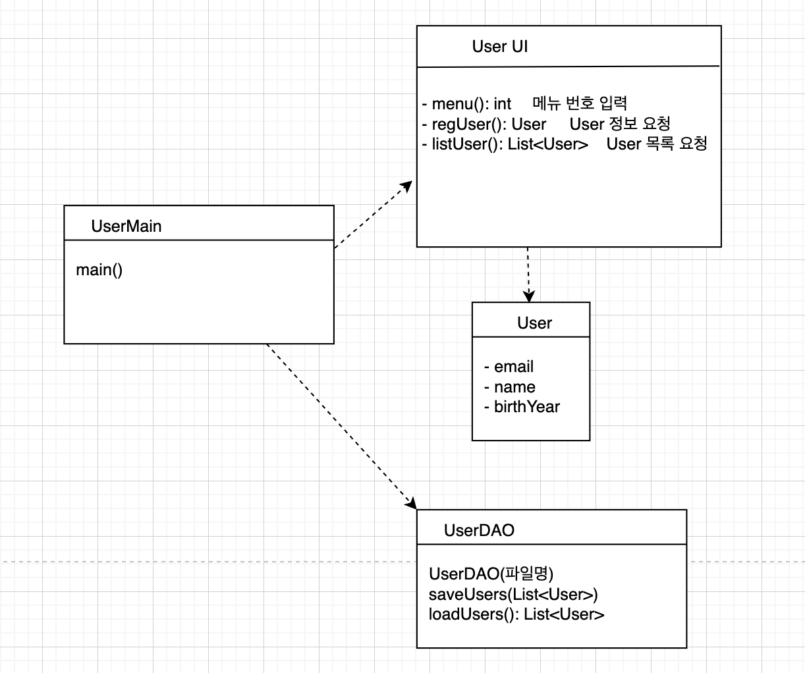

#### User

```java
public class User implements Serializable {
    private String email;
    private String name;
    private int birthYear;

    public User(String email, String name, int birthYear) {
        this.email = email;
        this.name = name;
        this.birthYear = birthYear;
    }

    public String getEmail() {
        return email;
    }

    public String getName() {
        return name;
    }

    public int getBirthYear() {
        return birthYear;
    }

    @Override
    public String toString() {
        return "User{" +
                "email='" + email + '\'' +
                ", name='" + name + '\'' +
                ", birthYear=" + birthYear +
                '}';
    }
}

```

#### UserDao

- saveUser(파일명) : 파일에 User 정보 등록
- loadUSer(): User 정보 읽어오기

```java
public class UserDao {
    private  String filename;

    public UserDao(String filename) {
        this.filename = filename;
    }

    public void saveUser(List<User> userList) {
        try(ObjectOutputStream out = new ObjectOutputStream(new FileOutputStream(filename))) {
            out.writeObject(userList);
        } catch (Exception e) {
            e.printStackTrace();
        }
    }

    public List<User> loadUser() {
        File file = new File(filename);

        // 파일이 존재하는 지 확인
        if (!file.exists()) {
            return new ArrayList<>();
        }

        List<User> list = null;
        try (ObjectInputStream in = new ObjectInputStream(new FileInputStream(filename))) {
             list = (List<User>) in.readObject();
        } catch (Exception e) {
            e.printStackTrace();
        }
        return list;
    }
}
```

#### UserUI

```java
public class UserUI {
    private BufferedReader br;

    public UserUI() {
        br = new BufferedReader(new InputStreamReader(System.in));
    }

    public int menu() throws IOException {
        System.out.println("1. 회원 등록");
        System.out.println("2. 회원 목록 보기");
        System.out.println("3. 프로그램 종료");

        String line = br.readLine();
        return Integer.parseInt(line);
    }

    // User 등록
    public User regMenu() {
        try {
            System.out.print("email을 입력하세요: ");
            String email = br.readLine();
            System.out.print("이름을 입력하세요: ");
            String name = br.readLine();
            System.out.print("생년을 입력하세요: ");
            int birthYear = Integer.parseInt(br.readLine());

            User user = new User(email, name, birthYear);
            return user;

        } catch (IOException e) {
            throw new RuntimeException(e);
        }
    }

    // User 목록 보기
    public void listUser(List<User> users) {
        System.out.println("email           이름          생년");
        System.out.println("================================");
        for (User user : users) {
            System.out.print(user.getEmail());
            System.out.print("      ");
            System.out.print(user.getName());
            System.out.print("      ");
            System.out.print(user.getBirthYear());
            System.out.print("      ");
        }
    } 
}

```

#### UserMain

```java
public class UserMain {
    public static void main(String[] args) {
        UserUI userUI = new UserUI();
        UserDao userDao = new UserDao("/tmp/users.dat");
        List<User> users = userDao.loadUsers();

        // 메뉴
        while (true) {
            int menuId = userUI.menu();

            // 프로그램 종료
            if (menuId == 5) {
                System.out.println("프로그램을 종료합니다.");
                userDao.saveUser(users);
                break;

            // User 등록
            } else if (menuId == 1) {
                User user = userUI.regUser();
                users.add(user);
                System.out.println("등록이 완료되었습니다.");

            // User 목록 보기
            } else if (menuId == 2) {
                userUI.listUser(users);
            }
        }

    }
}

```

### User 수정

수정할 회원의 email을 입력 받기

* email 주소가 메모리상의 회원정보에 있을 경우: 수정
* email 주소가 메모리상의 회원정보에 없을 경우: "존재하지 않는 회원입니다."

```java
public void updateUser(List<User> users) {
        try {
            System.out.print("수정할 회원의 email을 입력하세요: ");
            String userEmail = br.readLine();

            int a = 0;

            for (int i = 0; i < users.size(); i++) {
                if (users.get(i).getEmail().equals(userEmail)) {
                    System.out.println(userEmail + " 회원의 정보를 수정합니다.");
                    System.out.print("이름을 입력하시오: ");
                    String updateName = br.readLine();
                    System.out.print("생년을 입력하시오: ");
                    int updateBirthYear = Integer.parseInt(br.readLine());

                    users.remove(i);
                    users.add(new User(userEmail, updateName, updateBirthYear));
                    a=1;
                    System.out.println("수정이 완료되었습니다.");
                }
            }

            if (a == 0) {
                System.out.println("존재하지 않는 User 입니다.");
            }
        } catch (IOException e) {
            throw new RuntimeException(e);
        }
    }
```

### User 삭제

```java
public void removeUser(List<User> users) {
        try {
            System.out.print("삭제할 회원의 email을 입력하세요: ");
            String userEmail = br.readLine();
            int a=0;

            for (int i = 0; i < users.size(); i++) {
                if (users.get(i).getEmail().equals(userEmail)) {

                    users.remove(i);
                    a = 1;
                    System.out.println("삭제가 완료되었습니다.");
                }
            }

            if (a==0) System.out.println("존재하지 않는 User입니다.");
        } catch (IOException e) {
            throw new RuntimeException(e);
        }
    }
```

## 코드 리펙토링

UserService 인터페이스 생성

```java
package com.example.io;

import java.util.Iterator;
import java.util.List;

public interface UserService {
    // 회원정보 등록
    public void addUser(User user);

    // 회원정보 수정 - 성공 유무 반환
    public boolean updateUser(User user);

    // 회원정보 삭제 - 성공 유무 반환
    public boolean deleteUser(String email);

    // 회원 목록 반환
    public Iterator<User> getUsers();

    // email에 해당하는 회원 있는지 확인
    public boolean exists(String email);
}

```

UserService 구현

```java
package com.example.io;

import java.util.ArrayList;
import java.util.Iterator;
import java.util.List;

// 메모리상에 User 정보를 관리하는 클래스
public class UserServiceInMemory implements UserService {
    private List<User> users;

    public UserServiceInMemory() {
        this.users = new ArrayList<>();
    }

    public UserServiceInMemory(List<User> users) {
        this.users = users;
    }

    @Override
    public void addUser(User user) {
        users.add(user);
    }

    @Override
    public boolean updateUser(User user) {
        boolean deleteFlag = deleteUser(user.getEmail());

        if (deleteFlag) {
            users.add(user);
            return true;
        } else {
            return false;
        }
    }

    @Override
    public boolean deleteUser(String email) {
        int findIndex = findIndex(email);

        if (findIndex > -1) {
            users.remove(findIndex);
            return true;
        } else {
            return false;
        }
    }

    // 필드 users 정보를 그래도 리턴할 것이냐?  - 외부에서 users 정보 조작 가능한 문제
    // 아니면 users 정보를 복사한 후 리턴할 것이냐?     - 동기화 문제
    // 따라서 users 정보를 읽기 전용으로 외부에 반환해주는 것이 좋다.
    // 읽기 전용 인터페이스인 Iterator 사용
    @Override
    public Iterator<User> getUsers() {
        return users.iterator();
    }

    @Override
    public boolean exists(String email) {
        if (findIndex(email) > -1) {
            return true;
        } else return false;
    }

    public int findIndex(String email) {
        int findIndex = -1;
        for (int i = 0; i < users.size(); i++) {
            if (users.get(i).getEmail().equals(email)) {
                findIndex = i;
                break;
            }
        }

        return findIndex;
    }
}

```

Main

```java
package com.example.io;

import java.util.List;

public class UserMain {
    public static void main(String[] args) {
        UserUI userUI = new UserUI();
        UserDao userDao = new UserDao("/tmp/users.dat");
        UserService userService = new UserServiceInMemory(userDao.loadUsers());

        // 메뉴
        while (true) {
            int menuId = userUI.menu();

            // 프로그램 종료
            if (menuId == 5) {
                System.out.println("프로그램을 종료합니다.");
                userDao.saveUser(userService.getUsers());
                break;

            // User 등록
            } else if (menuId == 1) {
                User user = userUI.regUser();
                userService.addUser(user);
                System.out.println("등록이 완료되었습니다.");

            // User 목록 보기
            } else if (menuId == 2) {
                userUI.listUser(userService.getUsers());

            // User 수정
            } else if (menuId == 3) {
                String email = userUI.inputEmail();
                boolean isFindEmail = userService.exists(email);

                // 존재하는 User인 경우
                if (isFindEmail) {
                    User updateUser = userUI.inputUser(email);
                    userService.updateUser(updateUser);
                    System.out.println("수정이 완료되었습니다.");
                } else {
                    System.out.println("존재하지 않는 User입니다.");
                }

                // User 삭제
            } else if (menuId == 4) {
                String email = userUI.inputEmail();
                boolean isFindEmail = userService.exists(email);

                if (isFindEmail) {
                    userService.deleteUser(email);
                    System.out.println("삭제가 완료되었습니다.");
                } else {
                    System.out.println("존재하지 않는 User입니다.");
                }
            }

        }

    }
}
```


